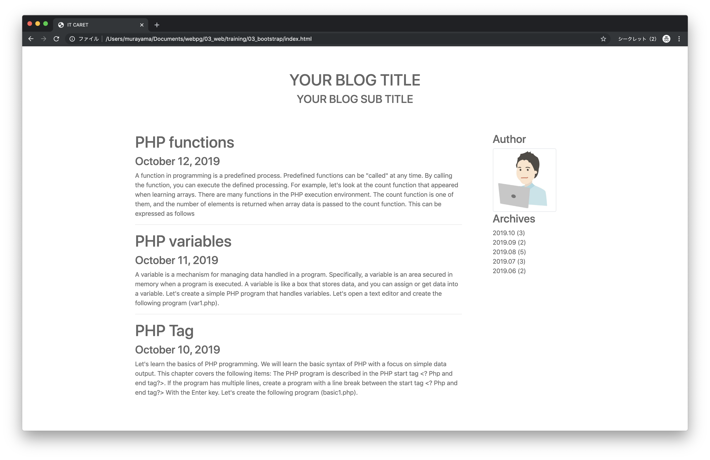

# トレーニング1 - Bootstrap

次の画面（training1.html、style1.css）を作成してください。

---



---

## training1.html

training1.htmlは以下のテンプレートを活用してください。

```html
<!DOCTYPE html>
<html lang="ja">
<head>
  <meta charset="UTF-8">
  <meta name="viewport" content="width=device-width, initial-scale=1.0"/>
  <title>IT CARET</title>
  <link rel="stylesheet" href="https://stackpath.bootstrapcdn.com/bootstrap/4.3.1/css/bootstrap.min.css" integrity="sha384-ggOyR0iXCbMQv3Xipma34MD+dH/1fQ784/j6cY/iJTQUOhcWr7x9JvoRxT2MZw1T" crossorigin="anonymous">
  <style media="screen">
    /* TODO */
  </style>
</head>
<body>

  <div class="container blog-top">
    /* TODO */
  </div>

  <div class="container blog-main">
    <div class="row">
      <div class="col-md-9">
        /* TODO */
      </div>

      <div class="col-md-3">
        /* TODO */
      </div>
    </div>
  </div>
</body>
</html>
```

## 画像素材

以下の１つの画像（author.png）を作業フォルダ上にimgフォルダを作成して保存してください。

### 画像素材 - Author（author.png）


> author.pngファイルは差し替えてもらってもOKです。

## 文章素材

以下の文章をコピーして利用できます。

### 文章素材 - トップ

```
YOUR BLOG TITLE
YOUR BLOG SUB TITLE
```

> タイトル、サブタイトルをカスタマイズしてください。

### 文章素材 -  記事一覧

```
PHP functions
October 12, 2019
A function in programming is a predefined process. Predefined functions can be "called" at any time. By calling the function, you can execute the defined processing. For example, let's look at the count function that appeared when learning arrays. There are many functions in the PHP execution environment. The count function is one of them, and the number of elements is returned when array data is passed to the count function. This can be expressed as follows

PHP variables
October 11, 2019
A variable is a mechanism for managing data handled in a program. Specifically, a variable is an area secured in memory when a program is executed. A variable is like a box that stores data, and you can assign or get data into a variable. Let's create a simple PHP program that handles variables. Let's open a text editor and create the following program (var1.php).

PHP Tag
October 10, 2019
Let's learn the basics of PHP programming. We will learn the basic syntax of PHP with a focus on simple data output. This chapter covers the following items: The PHP program is described in the PHP start tag <? Php and end tag?>. If the program has multiple lines, create a program with a line break between the start tag <? Php and end tag?> With the Enter key. Let's create the following program (basic1.php).
```

### 文章素材 - サイドバー

```
Author

Archives
2019.10 (3)
2019.09 (2)
2019.08 (5)
2019.07 (3)
2019.06 (2)
```


<!--
## style1.css

style1.cssは以下のテンプレートを活用してください。

```css
* {
  color: #666666;
}

a, a:hover {
  color: #666666;
  text-decoration: none;
}

.blog-top {
  padding-top: 60px;
  padding-bottom: 60px;
}

.blog-top h1, .blog-top h3 {
  text-align:center;
}

.blog-main {
  margin-bottom: 120px;
}
```
-->


<!--
<!DOCTYPE html>
<html lang="ja">
<head>
  <meta charset="UTF-8">
  <meta name="viewport" content="width=device-width, initial-scale=1.0"/>
  <title>IT CARET</title>
  <link rel="stylesheet" href="https://stackpath.bootstrapcdn.com/bootstrap/4.3.1/css/bootstrap.min.css" integrity="sha384-ggOyR0iXCbMQv3Xipma34MD+dH/1fQ784/j6cY/iJTQUOhcWr7x9JvoRxT2MZw1T" crossorigin="anonymous">
  <style media="screen">
    * {
      color: #666666;
    }

    a, a:hover {
      color: #666666;
      text-decoration: none;
    }

    .blog-top {
      padding-top: 60px;
      padding-bottom: 60px;
    }

    .blog-top h1, .blog-top h3 {
      text-align:center;
    }

    .blog-main {
      margin-bottom: 120px;
    }
  </style>
</head>
<body>

  <div class="container blog-top">
    <h1>YOUR BLOG TITLE</h1>
    <h3>YOUR BLOG SUB TITLE</h3>
  </div>

  <div class="container blog-main">
    <div class="row">
      <div class="col-md-9">
        <h1><a href="#">PHP functions</a></h1>
        <h3>October 12, 2019</h3>
        <p>
          A function in programming is a predefined process. Predefined functions can be "called" at any time. By calling the function, you can execute the defined processing. For example, let's look at the count function that appeared when learning arrays.

          There are many functions in the PHP execution environment. The count function is one of them, and the number of elements is returned when array data is passed to the count function. This can be expressed as follows
        </p>
        <hr>

        <h1>PHP variables</h1>
        <h3>October 11, 2019</h3>
        <p>
          A variable is a mechanism for managing data handled in a program. Specifically, a variable is an area secured in memory when a program is executed. A variable is like a box that stores data, and you can assign or get data into a variable.

          Let's create a simple PHP program that handles variables. Let's open a text editor and create the following program (var1.php).
        </p>
        <hr>

        <h1>PHP Tag</h1>
        <h3>October 10, 2019</h3>
        <p>

          Let's learn the basics of PHP programming. We will learn the basic syntax of PHP with a focus on simple data output. This chapter covers the following items:

          The PHP program is described in the PHP start tag &lt;? Php and end tag?&gt;.

          If the program has multiple lines, create a program with a line break between the start tag &lt;? Php and end tag?&gt; With the Enter key. Let's create the following program (basic1.php).
        </p>
      </div>

      <div class="col-md-3">
        <div class="row">
          <div class="offset-md-2 col-md-8">
            <h3>Author</h3>
            
            <h3>Archives</h3>
            <ul class="list-unstyled">
              <li><a href="#">2019.10 (3)</a></li>
              <li><a href="#">2019.09 (2)</a></li>
              <li><a href="#">2019.08 (5)</a></li>
              <li><a href="#">2019.07 (3)</a></li>
              <li><a href="#">2019.06 (2)</a></li>
            </ul>
          </div>
        </div>
      </div>
    </div>
  </div>
</body>
</html>
-->