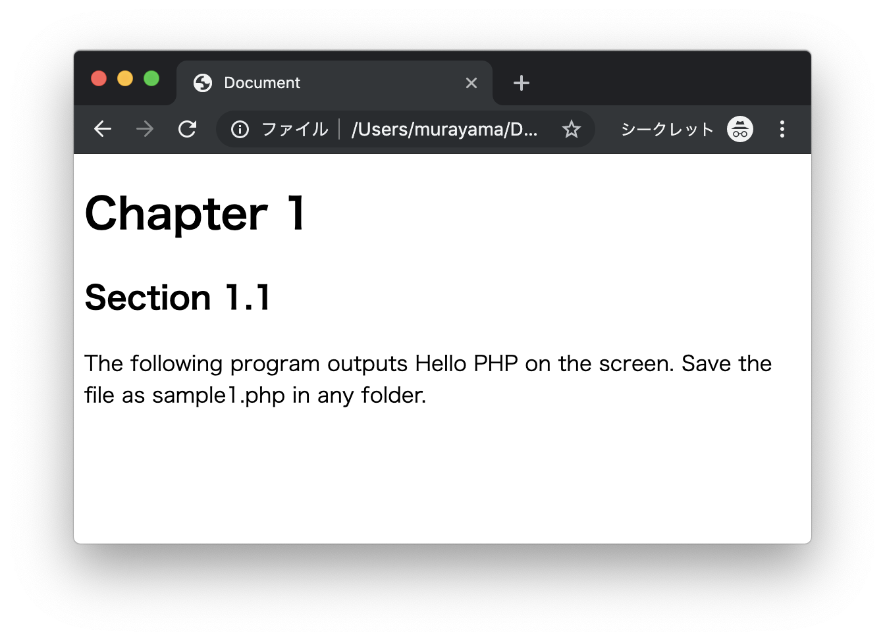
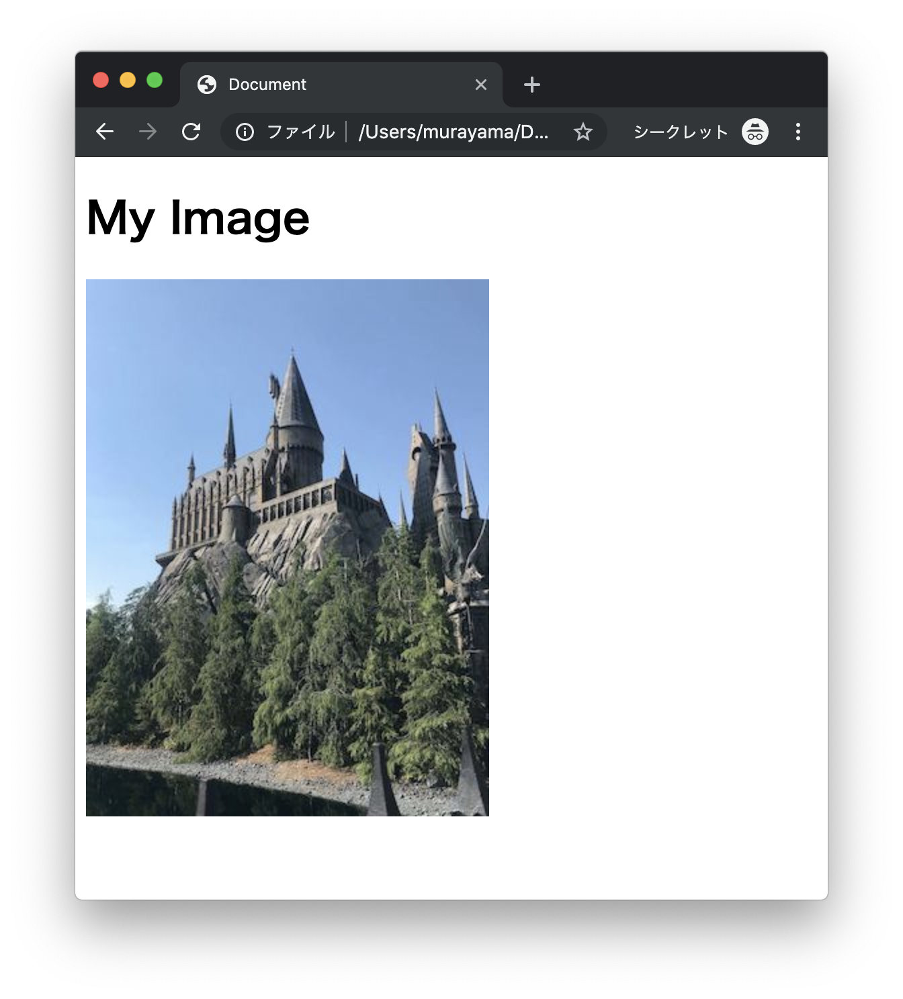
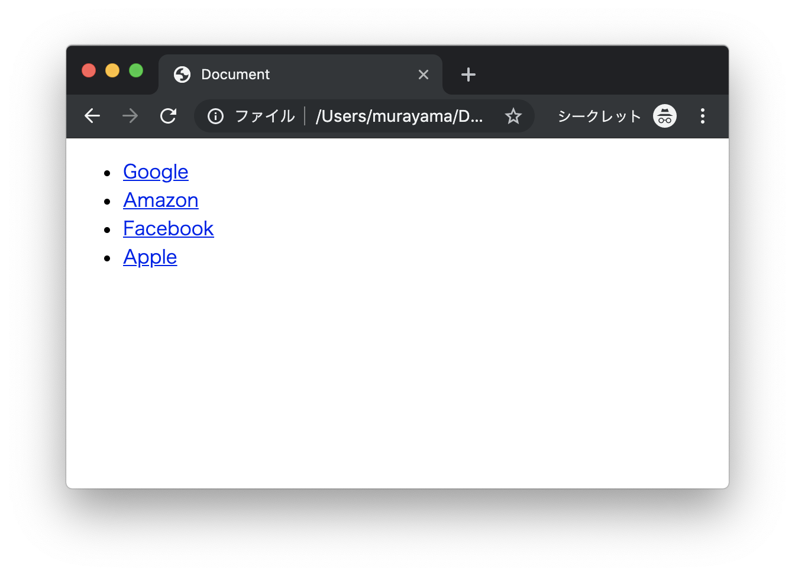
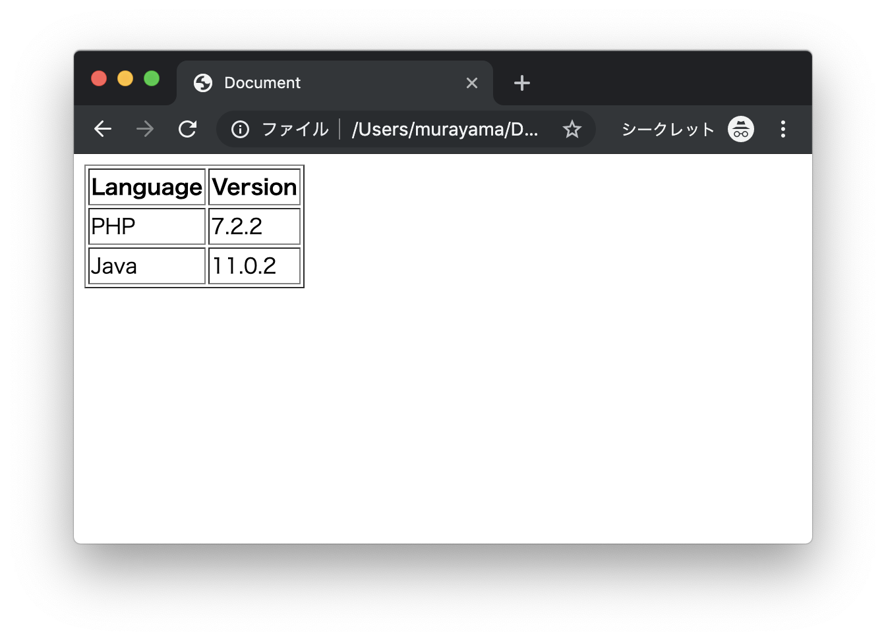
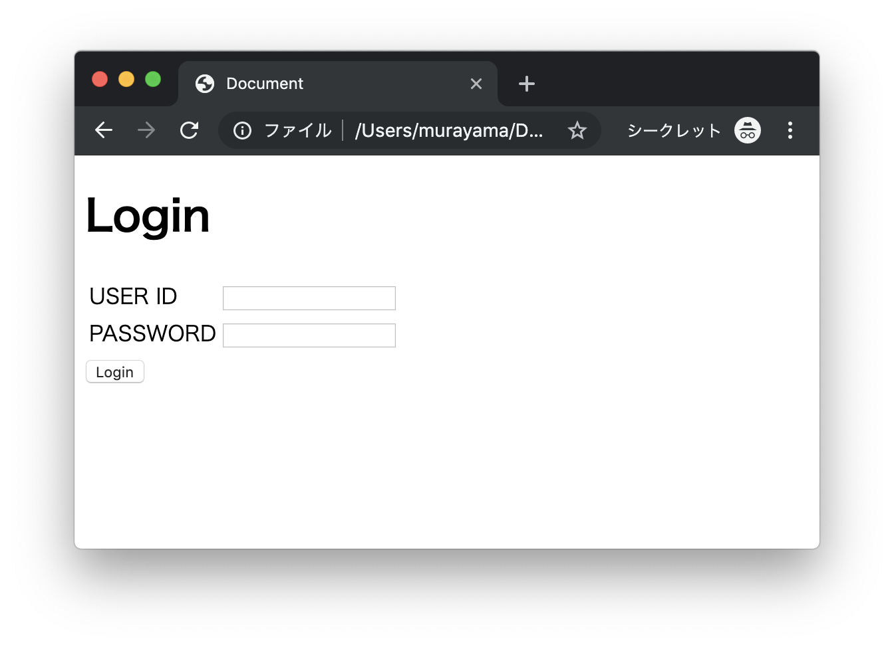

# エクササイズ - HTML

## web_ex1.html

次の実行結果となるようにHTMLプログラムを作成してください。

### 実行結果



### 素材

```
Chapter 1

Section 1.1

The following program outputs Hello PHP on the screen. Save the file as sample1.php in any folder.
```

> 素材はコピーして利用します。

---

## web_ex2.html

次の実行結果となるようにHTMLプログラムを作成してください。

### 実行結果



### 素材


> 上記の画像ファイルを右クリックのメニューからローカルに保存（sample.jpg）して利用します。

---

## web_ex3.html

次の実行結果となるようにHTMLプログラムを作成してください。

### 実行結果



### 素材

```
Google https://google.com/
Amazon https://amazon.com/
Facebook https://facebook.com/
Apple https://apple.com/
```

---

## web_ex4.html

次の実行結果となるようにHTMLプログラムを作成してください。

### 実行結果




### 素材

```
Language Version
PHP 7.2.2
Java 11.0.2
```

---

## web_ex5.html

次の実行結果となるようにHTMLプログラムを作成してください。

### 実行結果




---


