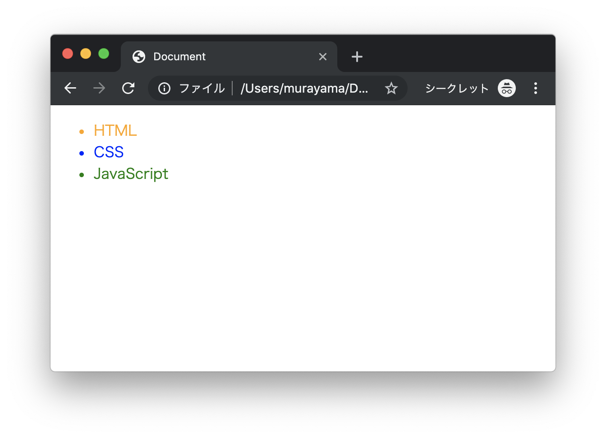
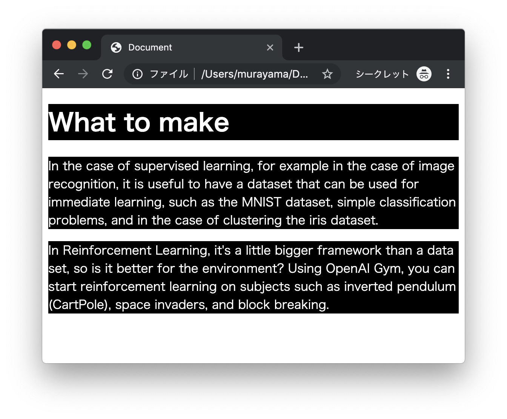
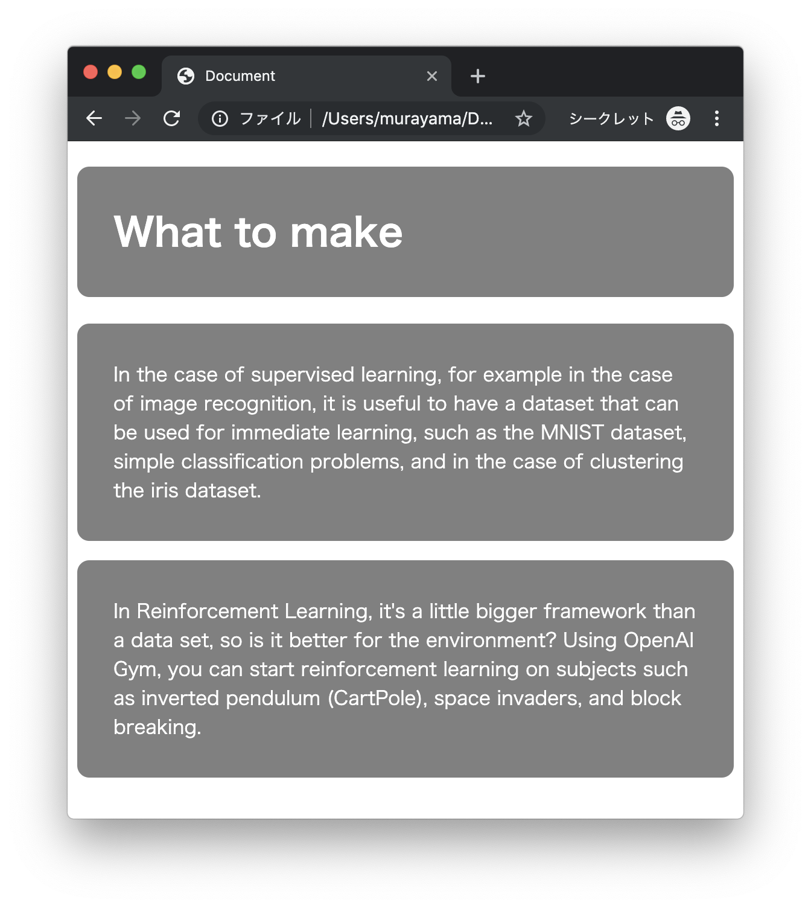

# エクササイズ - CSS

## web_ex21.html

次の実行結果となるようにプログラムを作成してください。

### 実行結果



### HTML

```html
<!DOCTYPE html>
<html lang="ja">
<head>
  <meta charset="UTF-8">
  <title>Document</title>
</head>
<body>
  <ul>
    <li>HTML</li>
    <li>CSS</li>
    <li>JavaScript</li>
  </ul>
</body>
</html>
```

> 上記のHTMLファイルにインラインスタイルシート（`style`属性）でスタイルを定義します。

---

## web_ex22.html

次の実行結果となるようにプログラムを作成してください。

### 実行結果



### HTML

```html
<!DOCTYPE html>
<html lang="ja">
<head>
  <meta charset="UTF-8">
  <title>Document</title>
</head>
<body>
  <h1>What to make</h1>
  <p>
    In the case of supervised learning, for example in the case of image recognition, it is useful to have a dataset that can be used for immediate learning, such as the MNIST dataset, simple classification problems, and in the case of clustering the iris dataset.
  </p>
  <p>
    In Reinforcement Learning, it's a little bigger framework than a data set, so is it better for the environment? Using OpenAI Gym, you can start reinforcement learning on subjects such as inverted pendulum (CartPole), space invaders, and block breaking.
  </p>
</body>
</html>
```

> 上記のHTMLファイルに内部スタイルシート（`style`タグ）でスタイルを定義します。

---

## web_ex23.html

次の実行結果となるようにプログラムを作成してください。

### 実行結果



### HTML

```html
<!DOCTYPE html>
<html lang="ja">
<head>
  <meta charset="UTF-8">
  <title>Document</title>
</head>
<body>
  <h1>What to make</h1>
  <p>
    In the case of supervised learning, for example in the case of image recognition, it is useful to have a dataset that can be used for immediate learning, such as the MNIST dataset, simple classification problems, and in the case of clustering the iris dataset.
  </p>
  <p>
    In Reinforcement Learning, it's a little bigger framework than a data set, so is it better for the environment? Using OpenAI Gym, you can start reinforcement learning on subjects such as inverted pendulum (CartPole), space invaders, and block breaking.
  </p>
</body>
</html>
```

> 上記のHTMLファイルに外部スタイルシート（`link`タグ）でスタイルを定義します。CSSファイル（my.css）を別途作成してください。

---

