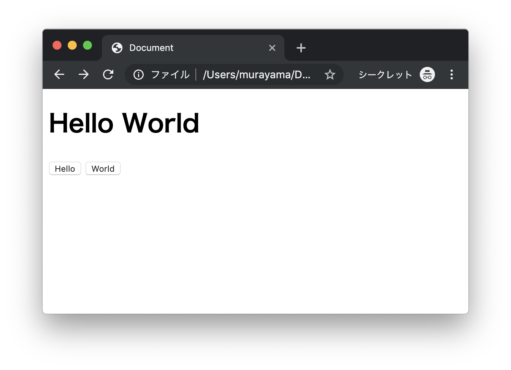
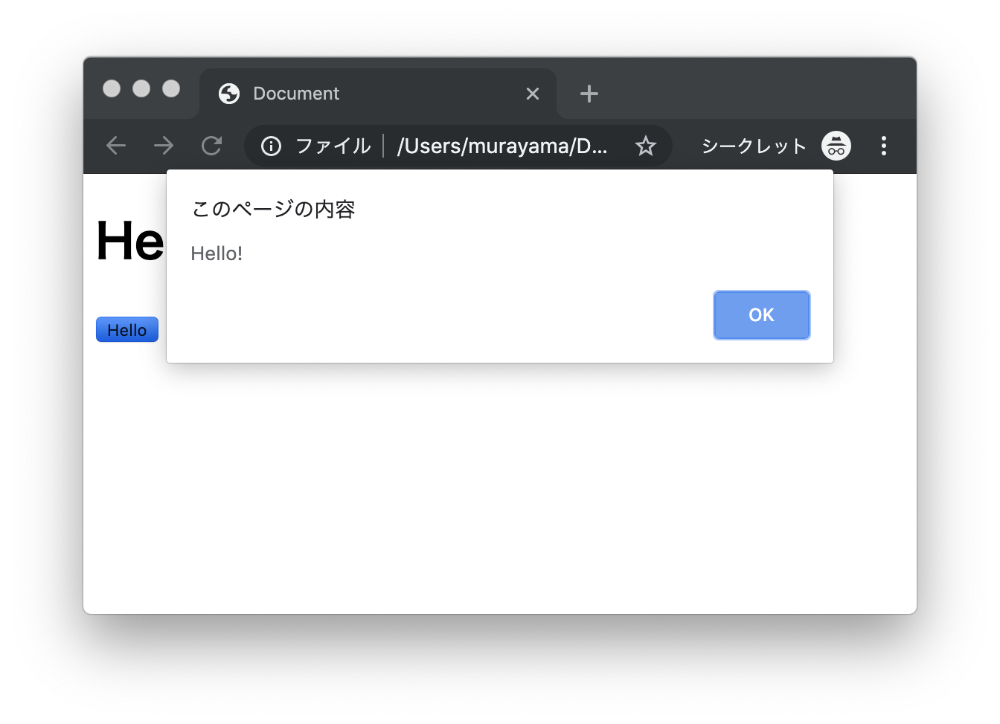
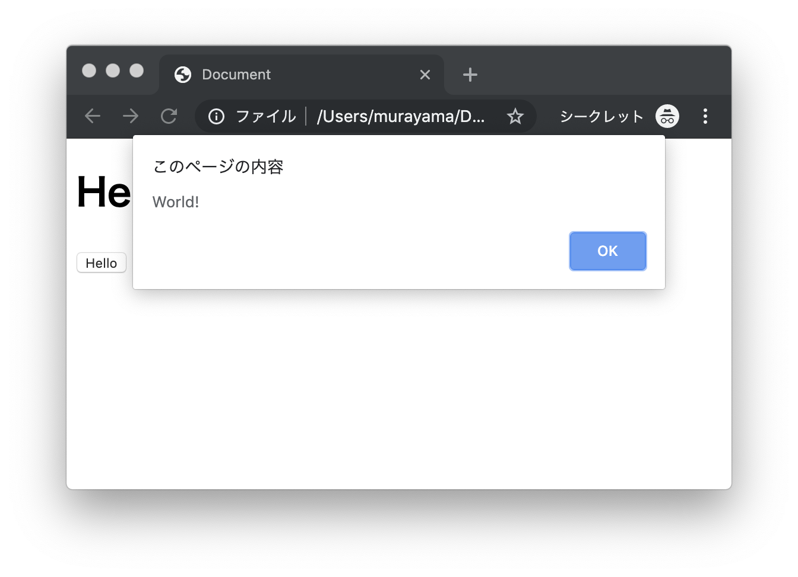
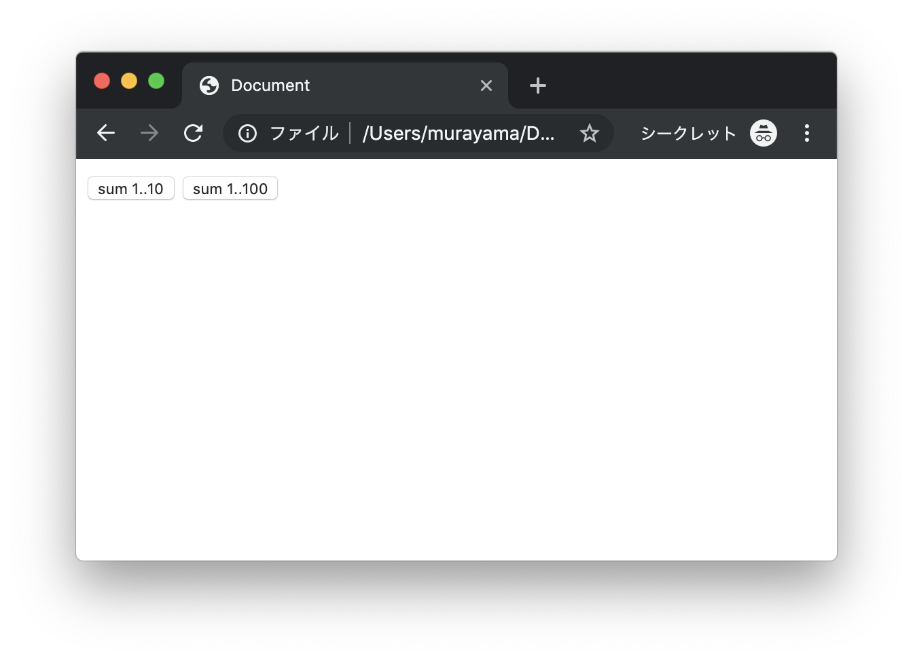
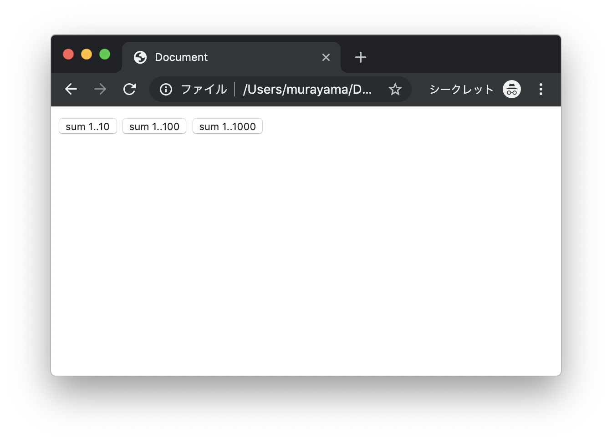
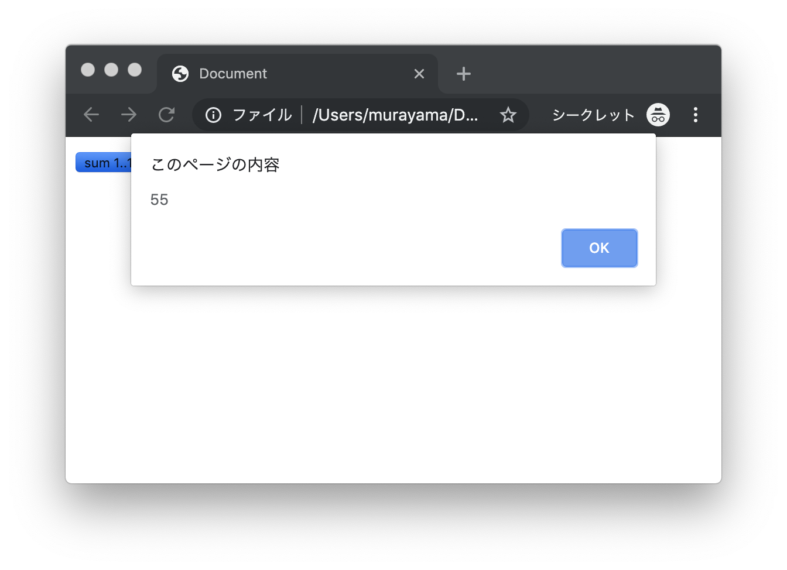
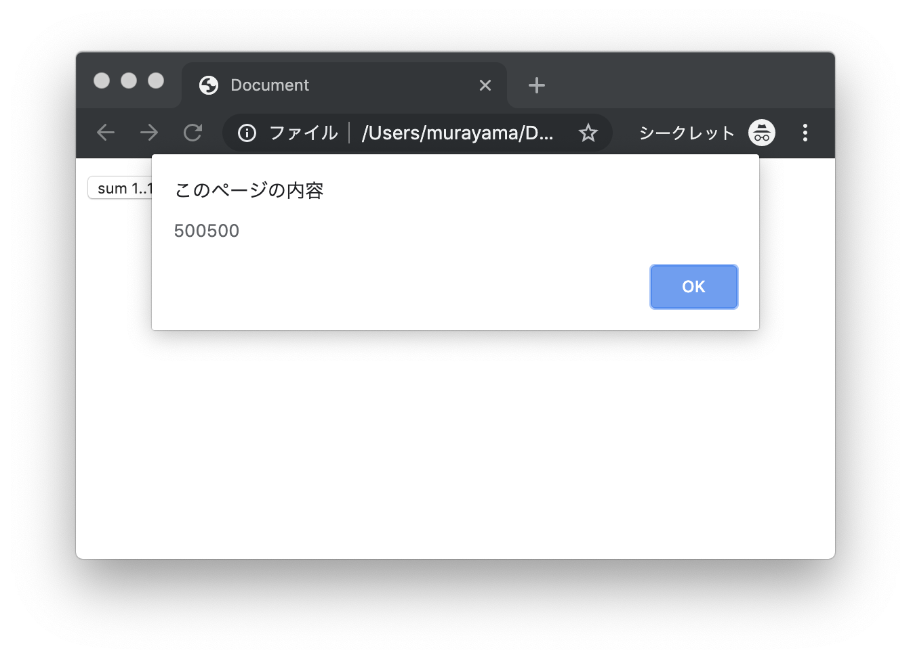

# エクササイズ - CSS

## web_ex31.html

次の実行結果となるようにプログラムを作成してください。

### 実行結果



#### Helloボタンクリック時



#### Worldボタンクリック時




### HTML

```html
<!DOCTYPE html>
<html lang="ja">
<head>
  <meta charset="UTF-8">
  <title>Document</title>
</head>
<body>
  <h1>Hello World</h1>
  <button onclick="???">Hello</button>
  <button onclick="???">World</button>
</body>
</html>
```

> 上記のHTMLファイルにインライン（`onclick`属性）でJavaScriptプログラムを記述します。

---

## web_ex32.html

次の実行結果となるようにプログラムを作成してください。

### 実行結果



#### sum 1..10ボタンクリック時


#### sum 1..100ボタンクリック時


### HTML

```html
<!DOCTYPE html>
<html lang="ja">
<head>
  <meta charset="UTF-8">
  <title>Document</title>
  <script type="text/javascript">
    function sum(number){
      var total = 0;

      // TODO

    }
  </script>
</head>
<body>
  <button onclick="sum(10)">sum 1..10</button>
  <button onclick="sum(100)">sum 1..100</button>
</body>
</html>
```

> 上記のHTMLファイルにインライン（`onclick`属性）でJavaScriptプログラムを記述します。

---


## web_ex33.html

次の実行結果となるようにプログラムを作成してください。

### 実行結果



#### sum 1..10ボタンクリック時



#### sum 1..100ボタンクリック時


#### sum 1..1000ボタンクリック時




### HTML

```html
<!DOCTYPE html>
<html lang="ja">
<head>
  <meta charset="UTF-8">
  <title>Document</title>
  <script type="text/javascript" src="my.js"></script>
</head>
<body>
  <button onclick="sum(10)">sum 1..10</button>
  <button onclick="sum(100)">sum 1..100</button>
  <button onclick="sum(1000)">sum 1..1000</button>
</body>
</html>
```

> my.jsファイルを作成してください。

---
