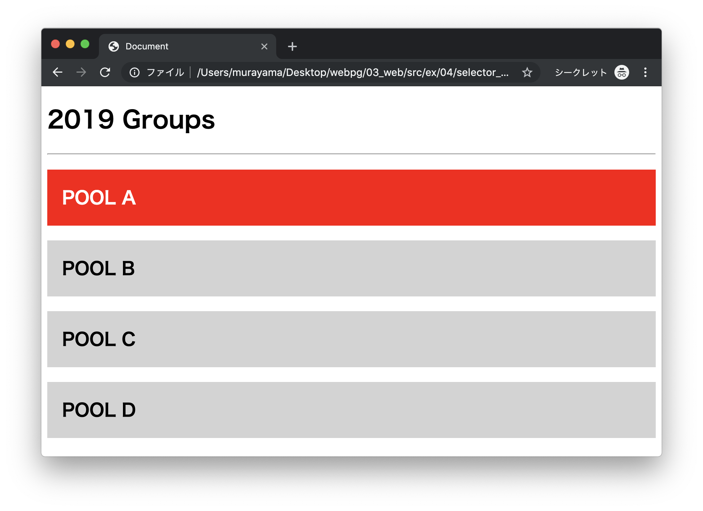
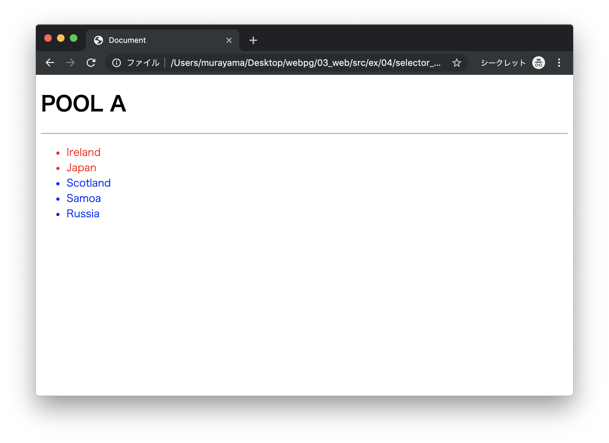
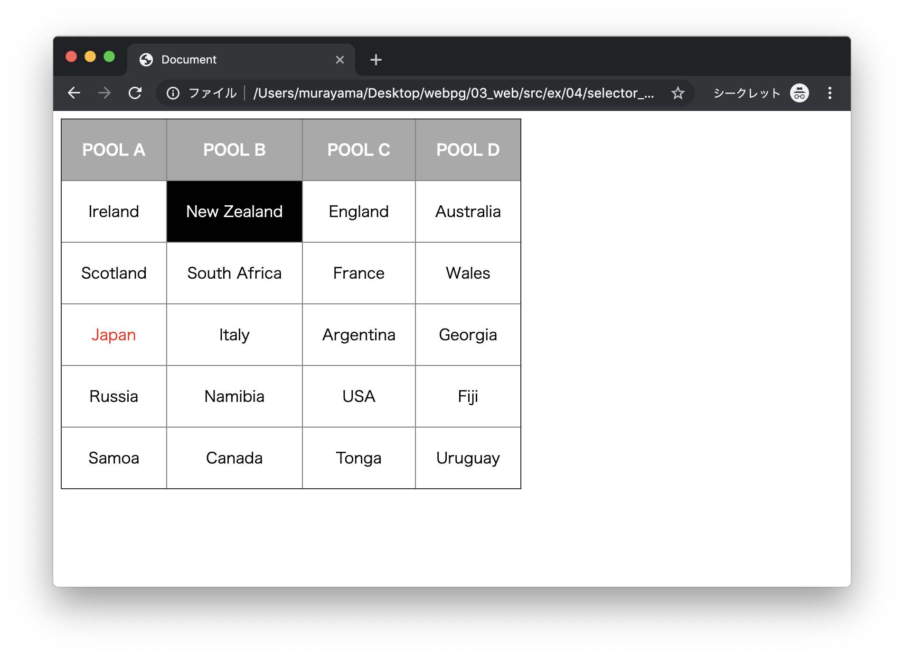

# エクササイズ - CSS

## selector_ex1.html

次の実行結果となるようにプログラムを作成してください。

### 実行結果



### HTML

```html
<!DOCTYPE html>
<html lang="ja">
<head>
  <meta charset="UTF-8">
  <title>Document</title>
  <style media="screen">
    /* TODO */
  </style>
</head>
<body>
  <h1>2019 Groups</h1>
  <hr>
  <h2 id="pool-a">POOL A</h2>
  <h2 id="pool-b">POOL B</h2>
  <h2 id="pool-c">POOL C</h2>
  <h2 id="pool-d">POOL D</h2>
</body>
</html>
```

> `style`タグの中にCSSプログラムを実装します。

---

## selector_ex2.html

次の実行結果となるようにプログラムを作成してください。

### 実行結果



### HTML

```html
<!DOCTYPE html>
<html lang="ja">
<head>
  <meta charset="UTF-8">
  <title>Document</title>
  <style media="screen">
    /* TODO */
  </style>
</head>
<body>
  <h1>POOL A</h1>
  <hr>
  <ul>
    <li class="red">Ireland</li>
    <li class="red">Japan</li>
    <li class="blue">Scotland</li>
    <li class="blue">Samoa</li>
    <li class="blue">Russia</li>
  </ul>
</body>
</html>
```

> `style`タグの中にCSSプログラムを実装します。

---

## selector_ex3.html

次の実行結果となるようにプログラムを作成してください。

### 実行結果



### HTML

```html
<!DOCTYPE html>
<html lang="ja">
<head>
  <meta charset="UTF-8">
  <title>Document</title>
  <style media="screen">
    /* TODO */
  </style>
</head>
<body>
  <table border="1">
    <tr class="row-0">
      <th class="col-a">POOL A</th>
      <th class="col-b">POOL B</th>
      <th class="col-c">POOL C</th>
      <th class="col-d">POOL D</th>
    </tr>
    <tr class="row-1">
      <td class="col-a">Ireland</td>
      <td class="col-b">New Zealand</td>
      <td class="col-c">England</td>
      <td class="col-d">Australia</td>
    </tr>
    <tr class="row-2">
      <td class="col-a">Scotland</td>
      <td class="col-b">South Africa</td>
      <td class="col-c">France</td>
      <td class="col-d">Wales</td>
    </tr>
    <tr class="row-3">
      <td class="col-a">Japan</td>
      <td class="col-b">Italy</td>
      <td class="col-c">Argentina</td>
      <td class="col-d">Georgia</td>
    </tr>
    <tr class="row-4">
      <td class="col-a">Russia</td>
      <td class="col-b">Namibia</td>
      <td class="col-c">USA</td>
      <td class="col-d">Fiji</td>
    </tr>
    <tr class="row-5">
      <td class="col-a">Samoa</td>
      <td class="col-b">Canada</td>
      <td class="col-c">Tonga</td>
      <td class="col-d">Uruguay</td>
    </tr>
  </table>
</body>
</html>
```

> `style`タグの中にCSSプログラムを実装します。

---
