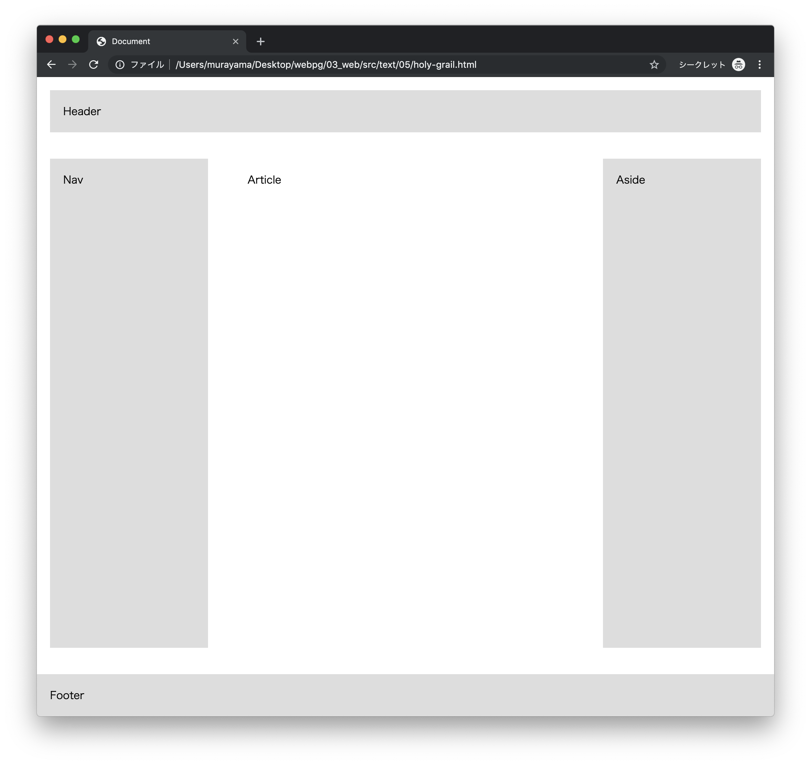

# エクササイズ - CSS

## flex_ex1.html

次の実行結果となるようにプログラムを作成してください。


### 実行結果



### HTML

```html
<!DOCTYPE html>
<html lang="ja">
<head>
  <meta charset="UTF-8">
  <title>Document</title>
  <style media="screen">
  /* TODO */
  </style>
</head>
<body>
  <header>Header</header>
  <div>
    <article>Article</article>
    <nav>Nav</nav>
    <aside>Aside</aside>
  </div>
  <footer>Footer</footer>
</body>
</html>
```

> `style`タグの中にCSSプログラムを実装します。

---

