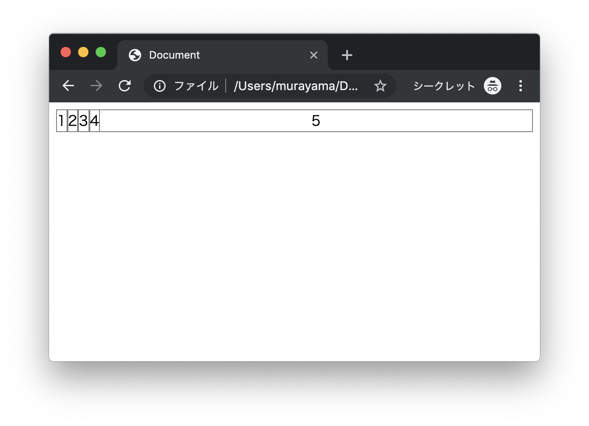
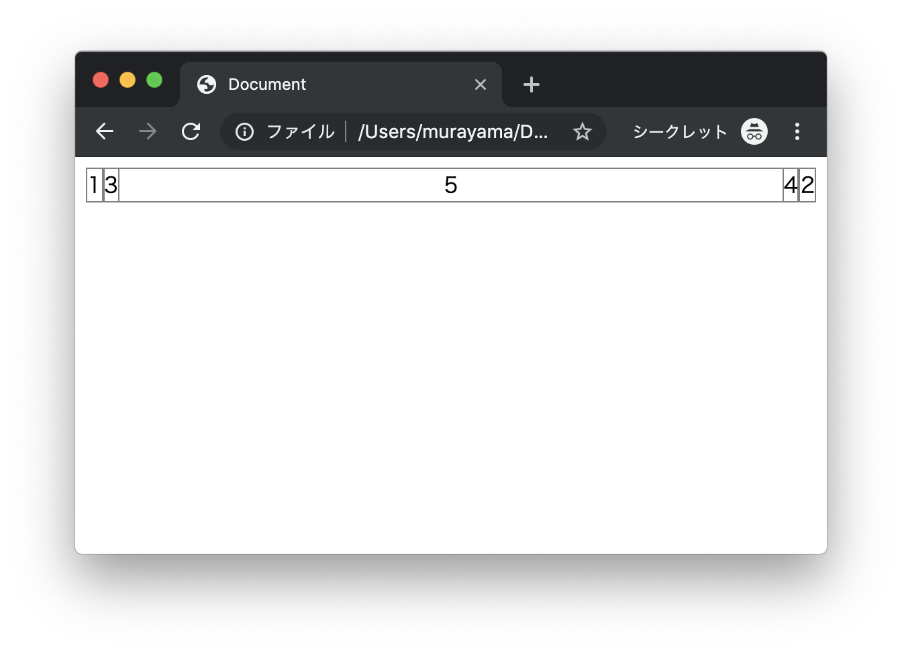

# エクササイズ - CSS

## float_ex1.html

次の実行結果となるようにプログラムを作成してください。

### 実行結果



### HTML

```html
<!DOCTYPE html>
<html lang="ja">
<head>
  <meta charset="UTF-8">
  <title>Document</title>
  <style>
    div {
      border: 1px solid gray;
      text-align: center;
    }

    /* TODO */

  </style>
</head>
<body>
  <div class="one">1</div>
  <div class="two">2</div>
  <div class="three">3</div>
  <div class="four">4</div>
  <div class="five">5</div>
</body>
</html>
```

> `style`タグの中にCSSプログラムを実装します。

---


## float_ex2.html

次の実行結果となるようにプログラムを作成してください。


### 実行結果



### HTML

```html
<!DOCTYPE html>
<html lang="ja">
<head>
  <meta charset="UTF-8">
  <title>Document</title>
  <style>
    div {
      border: 1px solid gray;
      text-align: center;
    }

    /* TODO */

  </style>
</head>
<body>
  <div class="one">1</div>
  <div class="two">2</div>
  <div class="three">3</div>
  <div class="four">4</div>
  <div class="five">5</div>
</body>
</html>
```

> `style`タグの中にCSSプログラムを実装します。

---


## float_ex3.html

次の実行結果となるようにプログラムを作成してください。

### 実行結果


### HTML

```html
<!DOCTYPE html>
<html lang="ja">
<head>
  <meta charset="UTF-8">
  <title>Document</title>
  <style>
    div {
      border: 1px solid gray;
      text-align: center;
    }

    /* TODO */

  </style>
</head>
<body>
  <div class="one">1</div>
  <div class="two">2</div>
  <div class="three">3</div>
  <div class="four">4</div>
  <div class="five">5</div>
</body>
</html>
```

> `style`タグの中にCSSプログラムを実装します。

---

