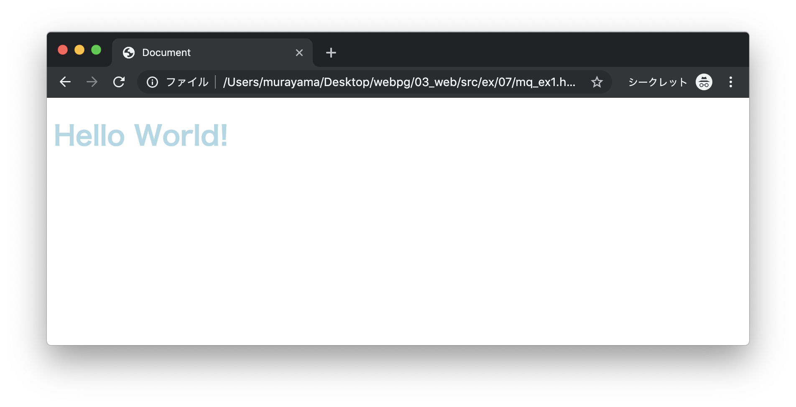
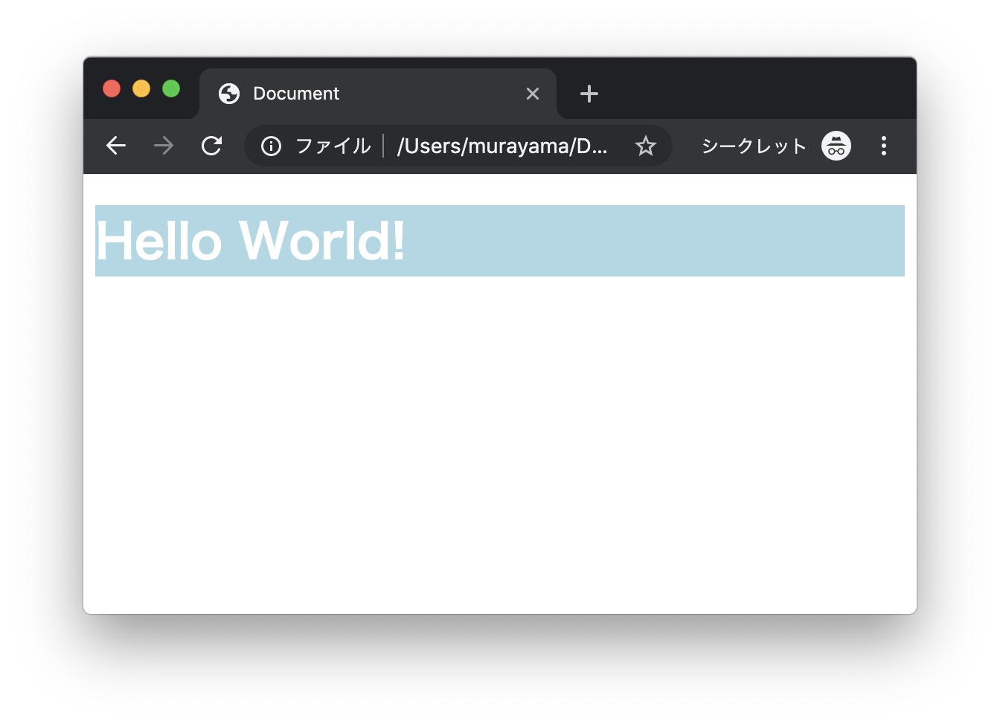
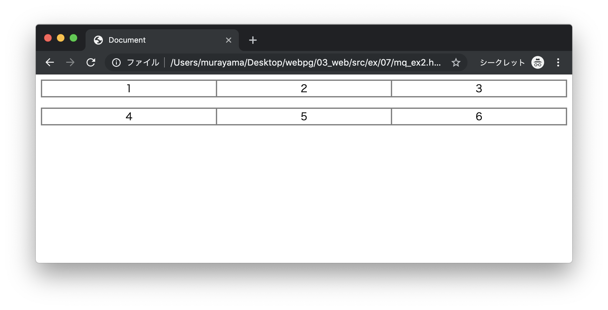
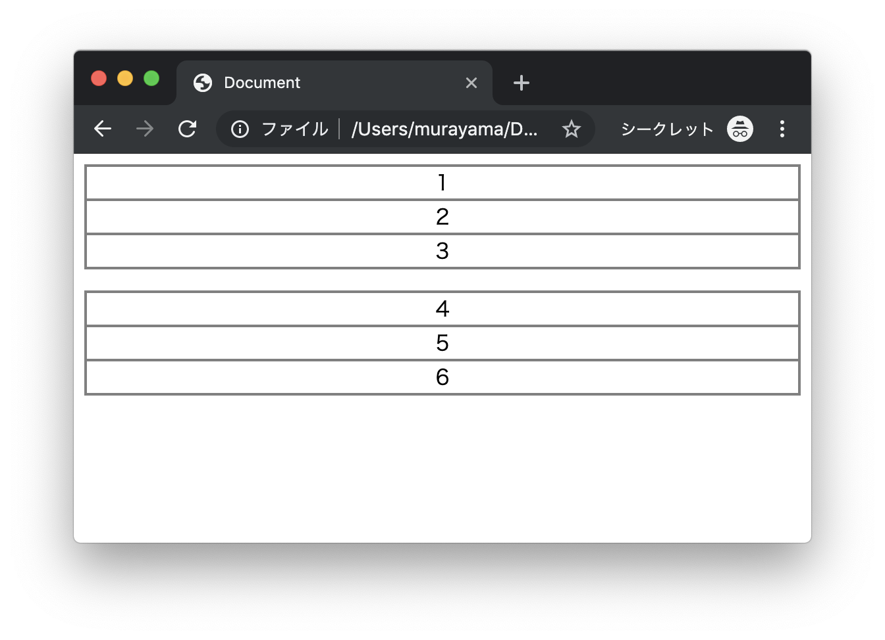
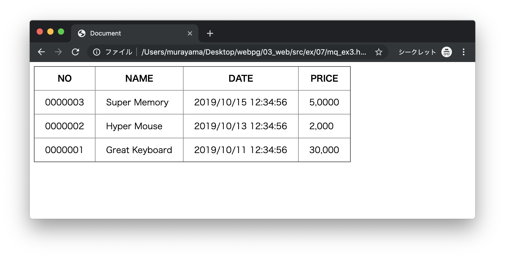
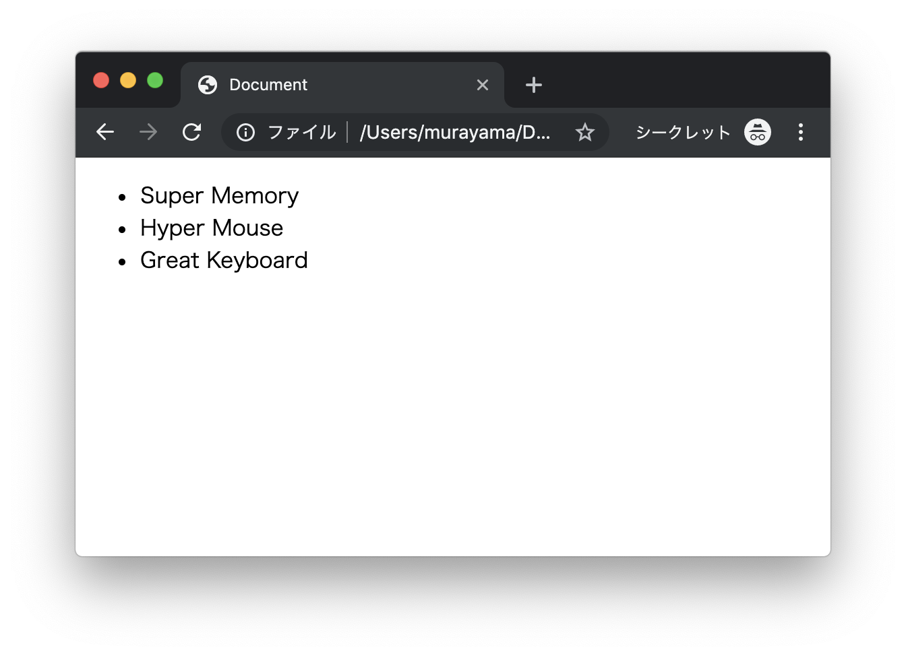

# エクササイズ - CSS

## mq_ex1.html

次の実行結果となるようにプログラムを作成してください。

### 実行結果

#### 画面サイズが600pxより大きい場合



#### 画面サイズが600px以下の場合




### HTML

```html
<!DOCTYPE html>
<html lang="ja">
<head>
  <meta charset="UTF-8">
  <title>Document</title>
  <style>
    h1 {
      color: lightblue;
    }

    @media only screen and (max-width:600px) {

      /* TODO */

    }
  </style>
</head>
<body>
  <h1>Hello World!</h1>
</body>
</html>
```

> `style`タグの中にCSSプログラムを実装します。

---


## mq_ex2.html

次の実行結果となるようにプログラムを作成してください。


### 実行結果

#### 画面サイズが600pxより大きい場合



#### 画面サイズが600px以下の場合




### HTML

```html
<!DOCTYPE html>
<html lang="ja">
<head>
  <meta charset="UTF-8">
  <title>Document</title>
  <style>
    div {
      border: 1px solid gray;
      text-align: center;
    }

    .row {
      display: flex;
      margin-bottom: 1rem;
    }

    .row div {
      flex: 1;
    }

    /* TODO */

  </style>
</head>
<body>
  <div class="row">
    <div class="one">1</div>
    <div class="two">2</div>
    <div class="three">3</div>
  </div>
  <div class="row">
    <div class="one">4</div>
    <div class="two">5</div>
    <div class="three">6</div>
  </div>
</body>
</html>
```

> `style`タグの中にCSSプログラムを実装します。

---


## mq_ex3.html

次の実行結果となるようにプログラムを作成してください。

### 実行結果

#### 画面サイズが600pxより大きい場合



#### 画面サイズが600px以下の場合




### HTML

```html
<!DOCTYPE html>
<html lang="ja">
<head>
  <meta charset="UTF-8">
  <title>Document</title>
  <style>
    table {
      border-collapse: collapse;;
    }
    
    th, td {
      padding: 10px 20px;
    }

    ul {
      display: none;
    }

    /* TODO */

  </style>
</head>
<body>
  <table border="1">
    <tr>
      <th>NO</th>
      <th>NAME</th>
      <th>DATE</th>
      <th>PRICE</th>
    </tr>
    <tr>
      <td>0000003</td>
      <td>Super Memory</td>
      <td>2019/10/15 12:34:56</td>
      <td>5,0000</td>
    </tr>
    <tr>
      <td>0000002</td>
      <td>Hyper Mouse</td>
      <td>2019/10/13 12:34:56</td>
      <td>2,000</td>
    </tr>
    <tr>
      <td>0000001</td>
      <td>Great Keyboard</td>
      <td>2019/10/11 12:34:56</td>
      <td>30,000</td>
    </tr>
  </table>

  <ul>
    <li>Super Memory</li>
    <li>Hyper Mouse</li>
    <li>Great Keyboard</li>
  </ul>
</body>
</html>
```

> `style`タグの中にCSSプログラムを実装します。

---

