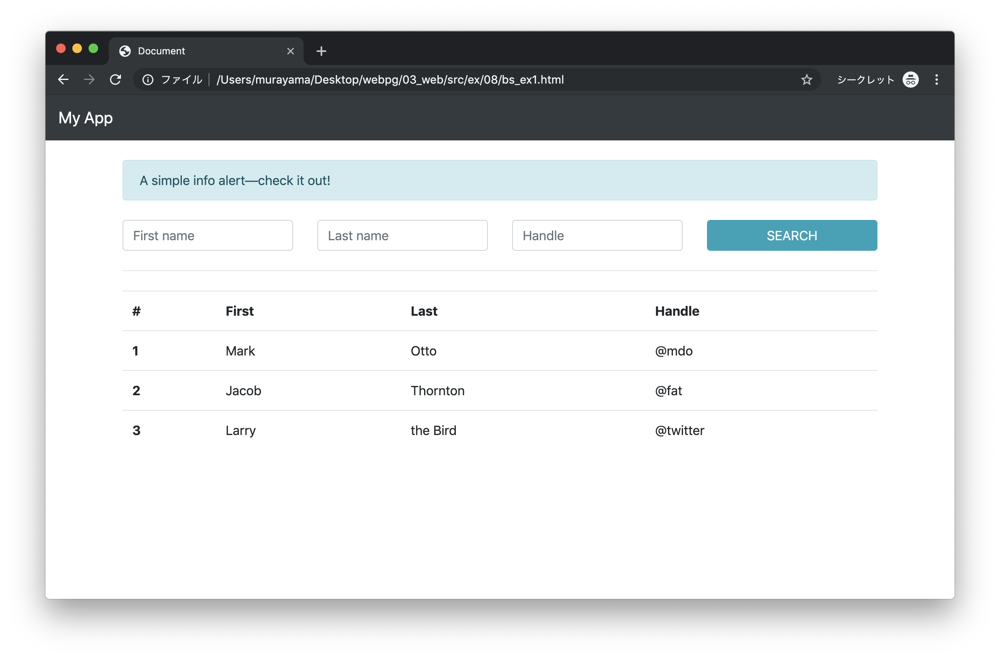
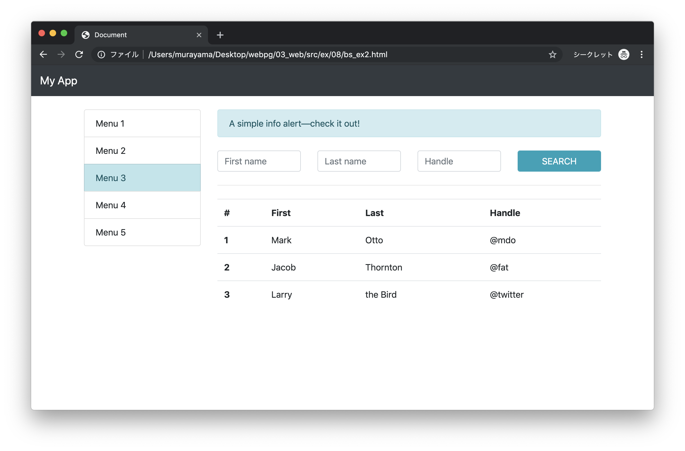

# エクササイズ - CSS

## bs_ex1.html

以下の手順に従って、実行結果に示すBootstrapを使ったWebページを開発します。

1. Bootstrapテンプレートの作成
2. Navbar、Containerの作成
3. Alertの作成
4. Formの作成
5. Hrの作成
6. Tableの作成

> 以降はコピー＆ペーストで実装します。

### 実行結果




### 1. Bootstrapテンプレートの作成

```html
<!DOCTYPE html>
<html lang="ja">
<head>
  <meta charset="UTF-8">
  <title>Document</title>
  <link rel="stylesheet" href="https://stackpath.bootstrapcdn.com/bootstrap/4.3.1/css/bootstrap.min.css" integrity="sha384-ggOyR0iXCbMQv3Xipma34MD+dH/1fQ784/j6cY/iJTQUOhcWr7x9JvoRxT2MZw1T" crossorigin="anonymous">
  <script src="https://stackpath.bootstrapcdn.com/bootstrap/4.3.1/js/bootstrap.min.js" integrity="sha384-JjSmVgyd0p3pXB1rRibZUAYoIIy6OrQ6VrjIEaFf/nJGzIxFDsf4x0xIM+B07jRM" crossorigin="anonymous"></script>
</head>
<body>
  <!-- TODO Navbar -->

  <!-- TODO Container -->
</body>
</html>
```

---

### 2. Navbar、Containerの作成


```html
...
<body>
  <!-- TODO Navbar -->
  <nav class="navbar navbar-dark bg-dark">
    <a class="navbar-brand" href="#">My App</a>
  </nav>

  <!-- TODO Container -->
  <div class="container mt-4">
    <!-- TODO Alert -->

    <!-- TODO Form -->

    <!-- TODO Hr -->

    <!-- TODO Table -->
  </div>
</body>
...
```


---


### 3. Alertの作成

```html
<div class="container mt-4">
  <!-- TODO Alert -->
  <div class="row">
    <div class="col">
      <div class="alert alert-info" role="alert">
        A simple info alert—check it out!
      </div>
    </div>
  </div>

  <!-- TODO Form -->

  <!-- TODO Hr -->

  <!-- TODO Table -->
</div>
```

---

### 4. Formの作成

```html
...
<div class="container mt-4">
  ...

  <!-- TODO Form -->
  <form>
    <div class="row mt-2">
      <div class="col">
        <input type="text" class="form-control" placeholder="First name">
      </div>
      <div class="col">
        <input type="text" class="form-control" placeholder="Last name">
      </div>
      <div class="col">
        <input type="text" class="form-control" placeholder="Handle">
      </div>
      <div class="col">
        <input type="submit" class="form-control btn btn-info" placeholder="Class name" value="SEARCH">
      </div>
    </div>
  </form>

  <!-- TODO Hr -->

  <!-- TODO Table -->
</div>
...
```

---


### 5. Hrの作成

```html
...
<div class="container mt-4">
  ...

  <!-- TODO Hr -->
  <div class="row mt-2 mb-2">
      <div class="col">
        <hr>
      </div>
  </div>

  <!-- TODO Table -->
</div>
...
```

---

### 6. Tableの作成


```html
...
<div class="container mt-4">
  ...

  <!-- TODO Table -->
  <div class="row">
    <div class="col">
      <table class="table">
        <tr>
          <th scope="col">#</th>
          <th scope="col">First</th>
          <th scope="col">Last</th>
          <th scope="col">Handle</th>
        </tr>
        <tr>
          <th scope="row">1</th>
          <td>Mark</td>
          <td>Otto</td>
          <td>@mdo</td>
        </tr>
        <tr>
          <th scope="row">2</th>
          <td>Jacob</td>
          <td>Thornton</td>
          <td>@fat</td>
        </tr>
        <tr>
          <th scope="row">3</th>
          <td>Larry</td>
          <td>the Bird</td>
          <td>@twitter</td>
        </tr>
      </table>
    </div>
</div>
...
```

---

### bs_ex1.html - 完成版

```html
<!DOCTYPE html>
<html lang="ja">
<head>
  <meta charset="UTF-8">
  <title>Document</title>
  <link rel="stylesheet" href="https://stackpath.bootstrapcdn.com/bootstrap/4.3.1/css/bootstrap.min.css" integrity="sha384-ggOyR0iXCbMQv3Xipma34MD+dH/1fQ784/j6cY/iJTQUOhcWr7x9JvoRxT2MZw1T" crossorigin="anonymous">
  <script src="https://stackpath.bootstrapcdn.com/bootstrap/4.3.1/js/bootstrap.min.js" integrity="sha384-JjSmVgyd0p3pXB1rRibZUAYoIIy6OrQ6VrjIEaFf/nJGzIxFDsf4x0xIM+B07jRM" crossorigin="anonymous"></script>
</head>
<body>

  <nav class="navbar navbar-dark bg-dark">
    <a class="navbar-brand" href="#">My App</a>
  </nav>

  <div class="container mt-4">

    <div class="row">
      <div class="col">
        <div class="alert alert-info" role="alert">
          A simple info alert—check it out!
        </div>
      </div>
    </div>

    <form>
      <div class="row mt-2">
        <div class="col">
          <input type="text" class="form-control" placeholder="First name">
        </div>
        <div class="col">
          <input type="text" class="form-control" placeholder="Last name">
        </div>
        <div class="col">
          <input type="text" class="form-control" placeholder="Handle">
        </div>
        <div class="col">
          <input type="submit" class="form-control btn btn-info" placeholder="Class name" value="SEARCH">
        </div>
      </div>
    </form>

    <div class="row mt-2 mb-2">
      <div class="col">
        <hr>
      </div>
    </div>

    <div class="row">
      <div class="col">
        <table class="table">
          <tr>
            <th scope="col">#</th>
            <th scope="col">First</th>
            <th scope="col">Last</th>
            <th scope="col">Handle</th>
          </tr>
          <tr>
            <th scope="row">1</th>
            <td>Mark</td>
            <td>Otto</td>
            <td>@mdo</td>
          </tr>
          <tr>
            <th scope="row">2</th>
            <td>Jacob</td>
            <td>Thornton</td>
            <td>@fat</td>
          </tr>
          <tr>
            <th scope="row">3</th>
            <td>Larry</td>
            <td>the Bird</td>
            <td>@twitter</td>
          </tr>
        </table>
      </div>
    </div>
  </div>
</body>
</html>
```

---

## bs_ex2.html

実行結果に示すようにサイドバーにメニューを表示するように修正します。

### 実行結果




### メニュー

```html
<ul class="list-group">
  <li class="list-group-item">Menu 1</li>
  <li class="list-group-item">Menu 2</li>
  <li class="list-group-item list-group-item-info">Menu 3</li>
  <li class="list-group-item">Menu 4</li>
  <li class="list-group-item">Menu 5</li>
</ul>
```

> 上記のHTMLコードを使って`bs_ex1.html`を修正します。