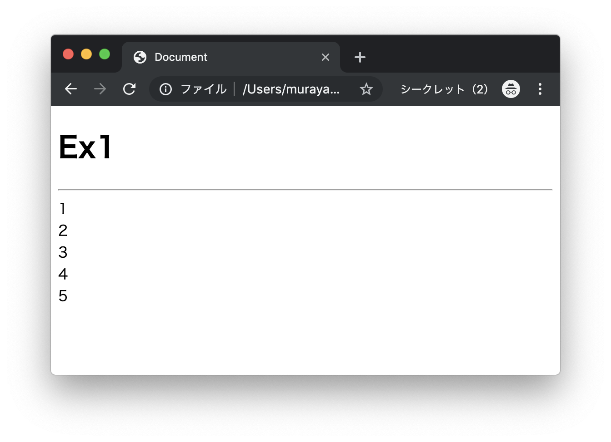
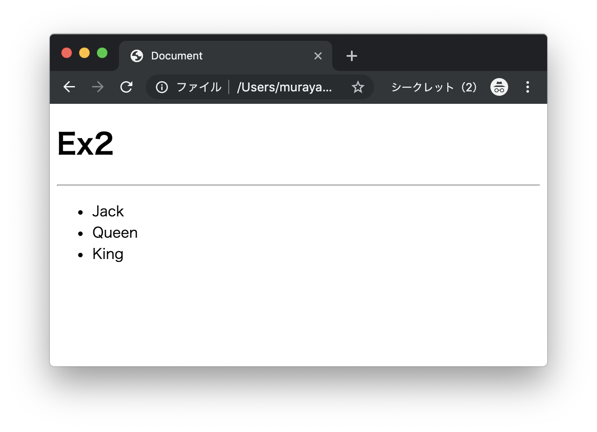
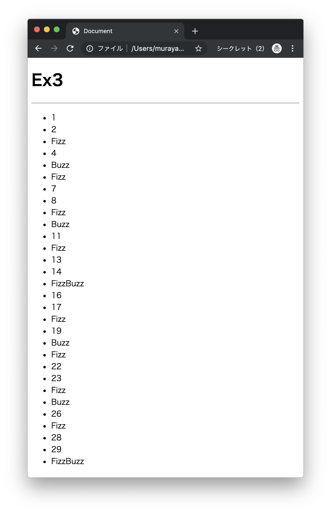
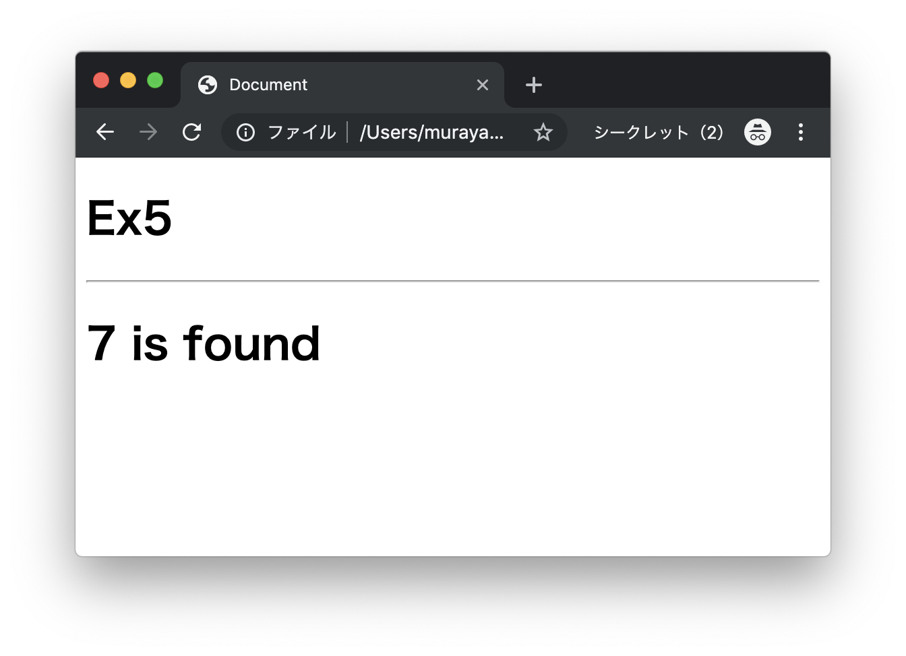
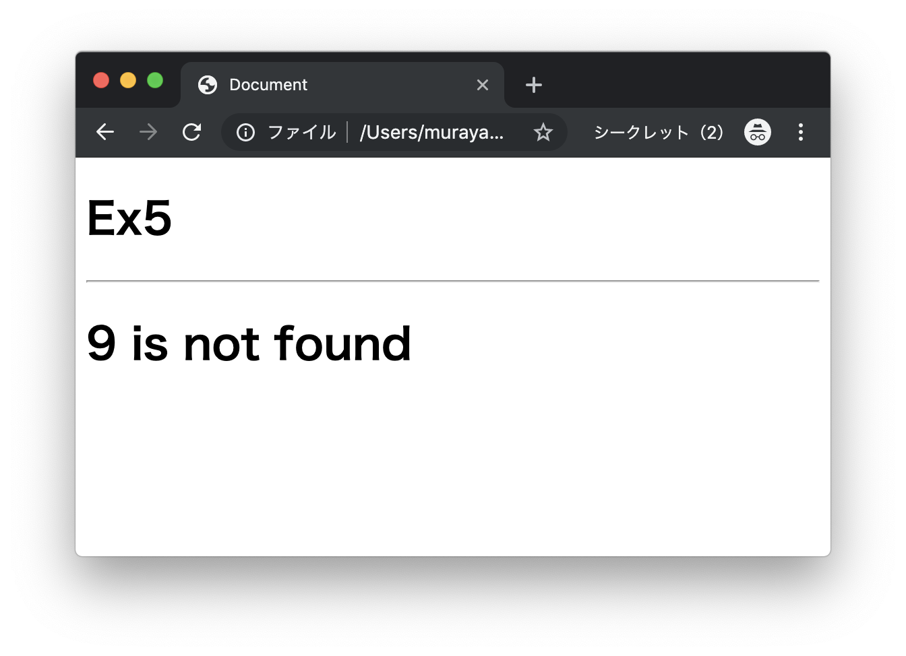

# エクササイズ - JavaScript - 基礎構文

## js_ex1.html

次の実行結果となるようにプログラムを作成してください。

### 実行結果




### HTML

```html
<!DOCTYPE html>
<html lang="ja">
<head>
  <meta charset="UTF-8">
  <title>Document</title>
</head>
<body>
  <h1>Ex1</h1>
  <hr>
  <script type="text/javascript">
    // TODO
  </script>
</body>
</html>
```

> `script`タグの中にJavaScriptプログラムを実装します。

---

## js_ex2.html

次の実行結果となるようにプログラムを作成してください。

### 実行結果




### HTML

```html
<!DOCTYPE html>
<html lang="ja">
<head>
  <meta charset="UTF-8">
  <title>Document</title>
</head>
<body>
  <h1>Ex2</h1>
  <hr>
  <script type="text/javascript">
    var names = ["Jack", "Queen", "King"];
    // TODO
  </script>
</body>
</html>
```

> `script`タグの中にJavaScriptプログラムを実装します。箇条書きの出力には`ul`タグ、`li`タグを使います。

---

## js_ex3.html

次の実行結果となるようにプログラムを作成してください。

### 実行結果



> FizzBuzzプログラムを作成します。

### HTML

```html
<!DOCTYPE html>
<html lang="ja">
<head>
  <meta charset="UTF-8">
  <title>Document</title>
</head>
<body>
  <h1>Ex3</h1>
  <hr>
  <script type="text/javascript">
    // TODO
  </script>
</body>
</html>
```

> `script`タグの中にJavaScriptプログラムを実装します。

---

## js_ex4.html

次の実行結果となるようにプログラムを作成してください。

### 実行結果


### HTML

```html
<!DOCTYPE html>
<html lang="ja">
<head>
  <meta charset="UTF-8">
  <title>Document</title>
</head>
<body>
  <h1>Ex4</h1>
  <hr>
  <script type="text/javascript">
    function max(array) {
      // TODO
    }

    var points = [6, 8, 3, 4, 7, 2];
    var result = max(points);
    document.write("<h1>Max: " + result + "</h1>");
  </script>
</body>
</html>
```

> `max`関数を定義します。

---

## js_ex5.html

次の実行結果となるようにプログラムを作成してください。

### 実行結果

#### 変数targetの値が7の場合（配列変数pointsの中に存在する場合）



#### 変数targetの値が9の場合（配列変数pointsの中に存在しない場合）



### HTML

```html
<!DOCTYPE html>
<html lang="ja">
<head>
  <meta charset="UTF-8">
  <title>Document</title>
</head>
<body>
  <h1>Ex5</h1>
  <hr>
  <script type="text/javascript">
    function search(array, target) {
      // TODO
    }

    var points = [6, 8, 3, 4, 7, 2];
    var target = 9;
    var result = search(points, target);
    if (result == true) {
      document.write("<h1>" + target + " is found</h1>");
    } else {
      document.write("<h1>" + target + " is not found</h1>");
    }
  </script>
</body>
</html>
```

> `search`関数を定義します。

---
