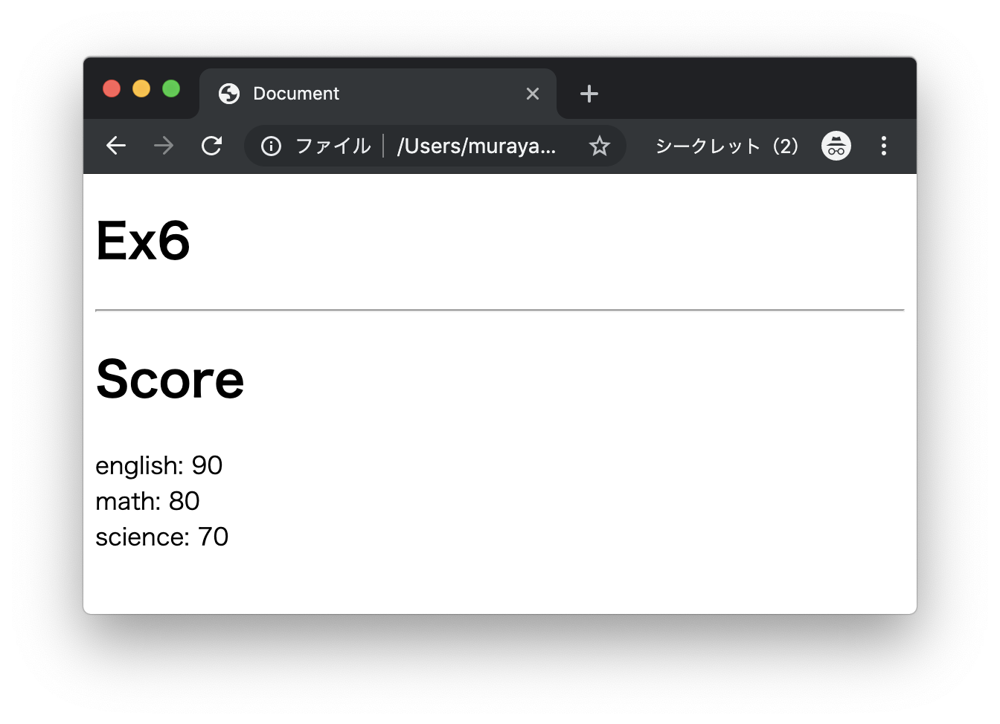
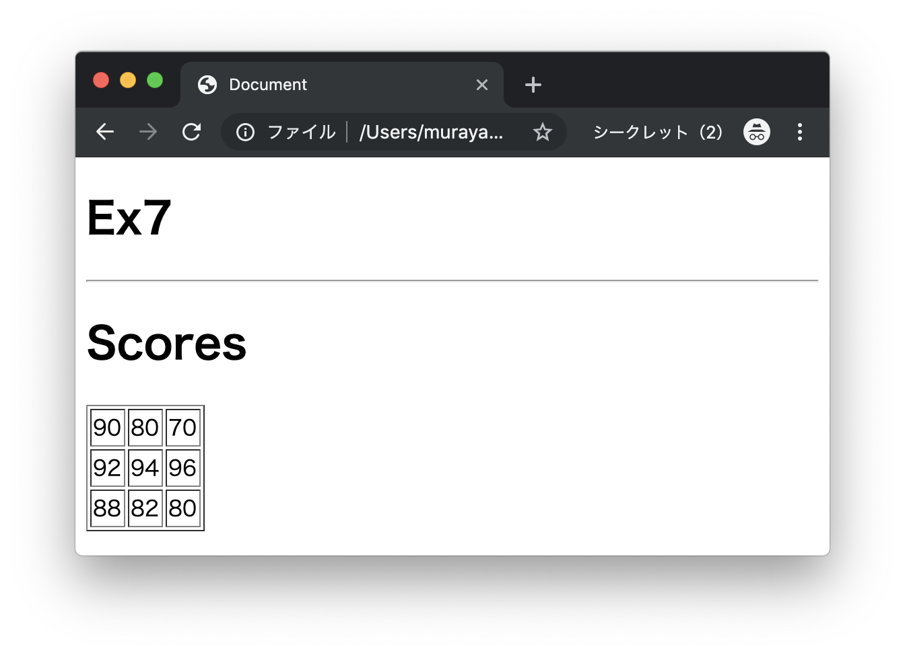
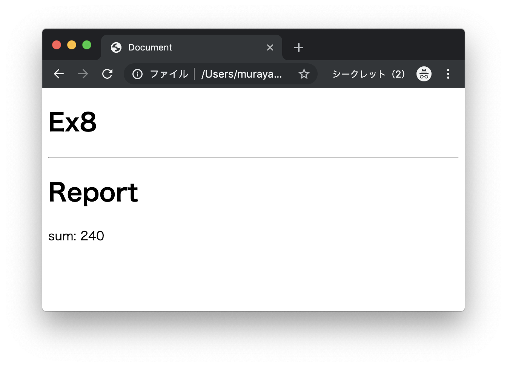
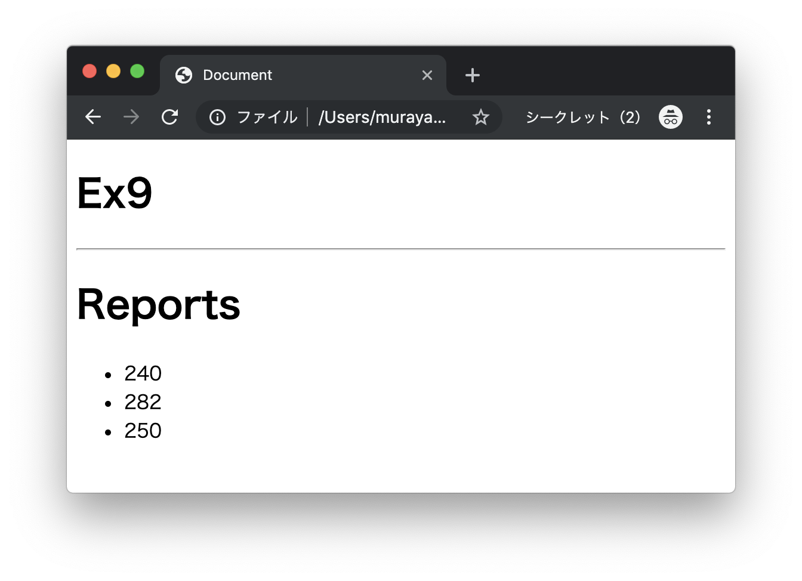

# エクササイズ - JavaScript - オブジェクト

## js_ex6.html

次の実行結果となるようにプログラムを作成してください。

### 実行結果




### HTML

```html
<!DOCTYPE html>
<html lang="ja">
<head>
  <meta charset="UTF-8">
  <title>Document</title>
</head>
<body>
  <h1>Ex6</h1>
  <hr>
  <script type="text/javascript">
    var score = {"english": 90, "math": 80, "science": 70};

    document.write("<h1>Score</h1>");
    document.write("english: " + ??? + "<br>");
    document.write("math: " + ??? + "<br>");
    document.write("science: " + ??? + "<br>");
  </script>
</body>
</html>
```

---

## js_ex7.html

次の実行結果となるようにプログラムを作成してください。

### 実行結果




### HTML

```html
<!DOCTYPE html>
<html lang="ja">
<head>
  <meta charset="UTF-8">
  <title>Document</title>
</head>
<body>
  <h1>Ex7</h1>
  <hr>
  <script type="text/javascript">
    var scores = [
      {"english": 90, "math": 80, "science": 70},
      {"english": 92, "math": 94, "science": 96},
      {"english": 88, "math": 82, "science": 80}
    ];

    // TODO
  </script>
</body>
</html>
```

> 表の出力には`table`タグ、`tr`タグ、`td`タグを使います。

---

## js_ex8.html

次の実行結果となるようにプログラムを作成してください。

### 実行結果



### HTML

```html
<!DOCTYPE html>
<html lang="ja">
<head>
  <meta charset="UTF-8">
  <title>Document</title>
</head>
<body>
  <h1>Ex8</h1>
  <hr>
  <script type="text/javascript">
    var report = {
                  "scores": [90, 80, 70],
                  "sum": function() {
                    // TODO
                  }
                };

    document.write("<h1>Report</h1>");
    document.write("sum: " + report.sum() + "<br>");
  </script>
</body>
</html>
```

---

## js_ex9.html

次の実行結果となるようにプログラムを作成してください。

### 実行結果



### HTML

```html
<!DOCTYPE html>
<html lang="ja">
<head>
  <meta charset="UTF-8">
  <title>Document</title>
</head>
<body>
  <h1>Ex9</h1>
  <hr>
  <script type="text/javascript">
    function sum() {
      // TODO
    }

    var reports = [
                    {"scores": [90, 80, 70], "sum": sum},
                    {"scores": [92, 94, 96], "sum": sum},
                    {"scores": [88, 82, 80], "sum": sum}
                  ];

    // TODO

  </script>
</body>
</html>
```


---
