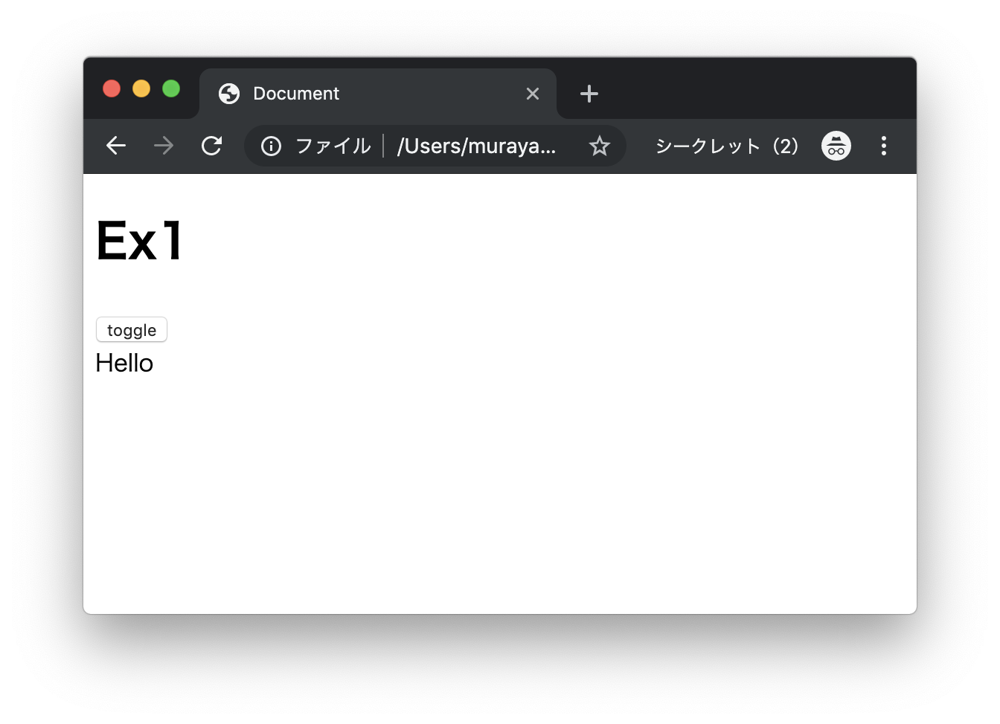
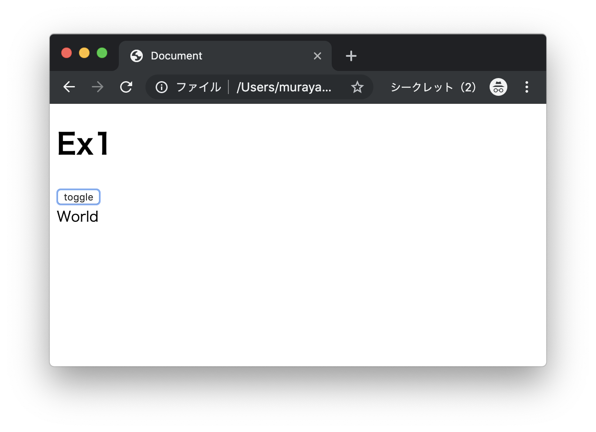
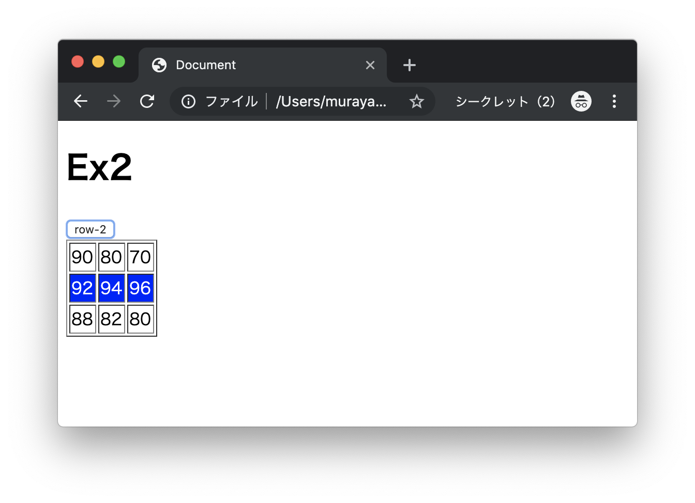
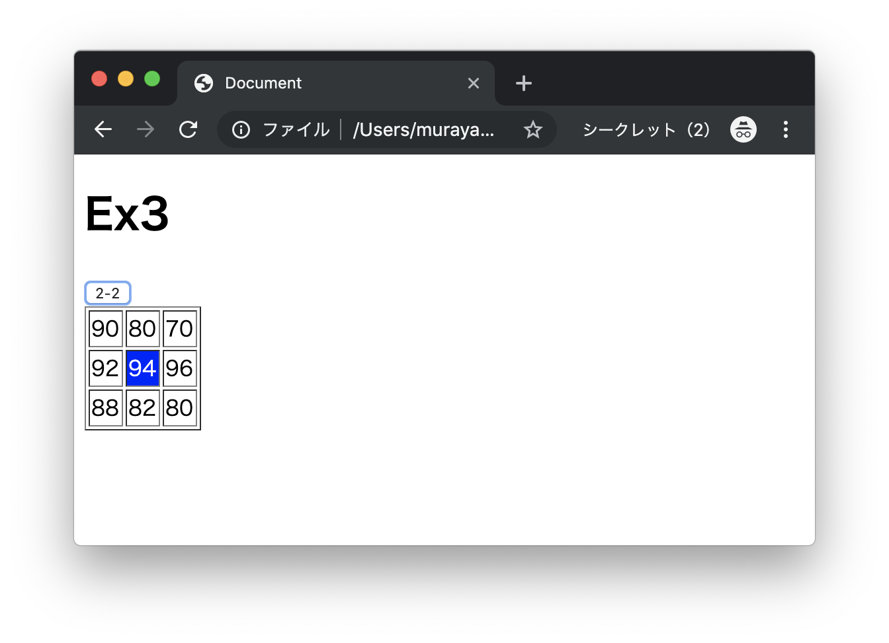
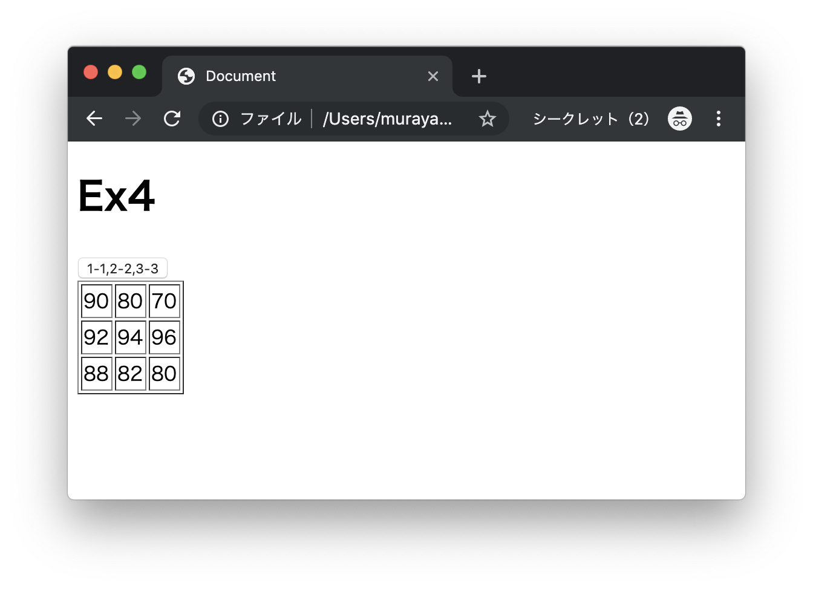
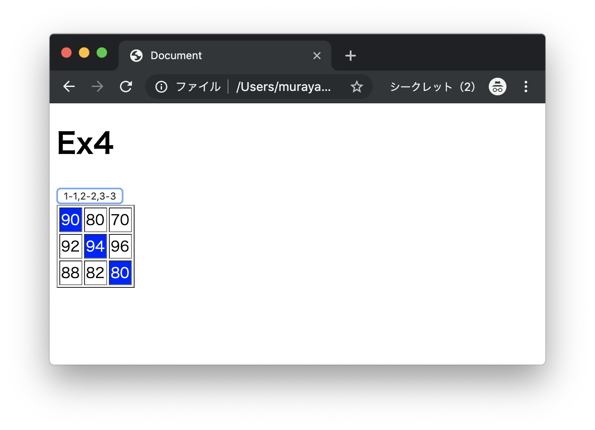

# エクササイズ - JavaScript - DOM - Part1

## dom_ex1.html

次の実行結果となるようにプログラムを作成してください。

### 実行結果

#### 初期表示時



#### ボタンクリック時



> ボタンを押すごとに`"Hello"`と`"World"`の出力を切り替えます。

### HTML

```html
<!DOCTYPE html>
<html lang="ja">
<head>
  <meta charset="UTF-8">
  <title>Document</title>
  <script type="text/javascript">
    function onClickHandler() {
      // TODO
    }
  </script>
</head>
<body>
  <h1>Ex1</h1>
  <button type="button" onclick="onClickHandler()">toggle</button>
  <div id="target">Hello</div>
</body>
</html>
```

> 上記のコードをコピーしてファイルを作成します。

---


## dom_ex2.html

次の実行結果となるようにプログラムを作成してください。

### 実行結果

#### 初期表示時


#### ボタンクリック時



### HTML

```html
<!DOCTYPE html>
<html lang="ja">
<head>
  <meta charset="UTF-8">
  <title>Document</title>
  <script type="text/javascript">
    function onClickHandler() {
      // TODO
    }

  </script>
</head>
<body>
  <h1>Ex2</h1>
  <button type="button" onclick="onClickHandler()">row-2</button>
  <table border="1">
    <tr class="row-1">
      <td class="col-1">90</td>
      <td class="col-2">80</td>
      <td class="col-3">70</td>
    </tr>
    <tr class="row-2">
      <td class="col-1">92</td>
      <td class="col-2">94</td>
      <td class="col-3">96</td>
    </tr>
    <tr class="row-3">
      <td class="col-1">88</td>
      <td class="col-2">82</td>
      <td class="col-3">80</td>
    </tr>
  </table>
</body>
</html>
```

> 上記のコードをコピーしてファイルを作成します。

---


## dom_ex3.html

次の実行結果となるようにプログラムを作成してください。

### 実行結果

#### 初期表示時


#### ボタンクリック時



### HTML

```html
<!DOCTYPE html>
<html lang="ja">
<head>
  <meta charset="UTF-8">
  <title>Document</title>
  <script type="text/javascript">
    function onClickHandler() {
      // TODO
    }
  </script>
</head>
<body>
  <h1>Ex3</h1>
  <button type="button" onclick="onClickHandler()">2-2</button>
  <table border="1">
    <tr class="row-1">
      <td class="col-1">90</td>
      <td class="col-2">80</td>
      <td class="col-3">70</td>
    </tr>
    <tr class="row-2">
      <td class="col-1">92</td>
      <td class="col-2">94</td>
      <td class="col-3">96</td>
    </tr>
    <tr class="row-3">
      <td class="col-1">88</td>
      <td class="col-2">82</td>
      <td class="col-3">80</td>
    </tr>
  </table>
</body>
</html>
```

> 上記のコードをコピーしてファイルを作成します。

---


## dom_ex4.html

次の実行結果となるようにプログラムを作成してください。

### 実行結果

#### 初期表示時



#### ボタンクリック時



### HTML

```html
<!DOCTYPE html>
<html lang="ja">
<head>
  <meta charset="UTF-8">
  <title>Document</title>
  <script type="text/javascript">
    function onClickHandler() {
      // TODO
    }
  </script>
</head>
<body>
  <h1>Ex4</h1>
  <button type="button" onclick="onClickHandler()">1-1,2-2,3-3</button>
  <table border="1">
    <tr class="row-1">
      <td class="col-1">90</td>
      <td class="col-2">80</td>
      <td class="col-3">70</td>
    </tr>
    <tr class="row-2">
      <td class="col-1">92</td>
      <td class="col-2">94</td>
      <td class="col-3">96</td>
    </tr>
    <tr class="row-3">
      <td class="col-1">88</td>
      <td class="col-2">82</td>
      <td class="col-3">80</td>
    </tr>
  </table>
</body>
</html>
```

> 上記のコードをコピーしてファイルを作成します。

---
