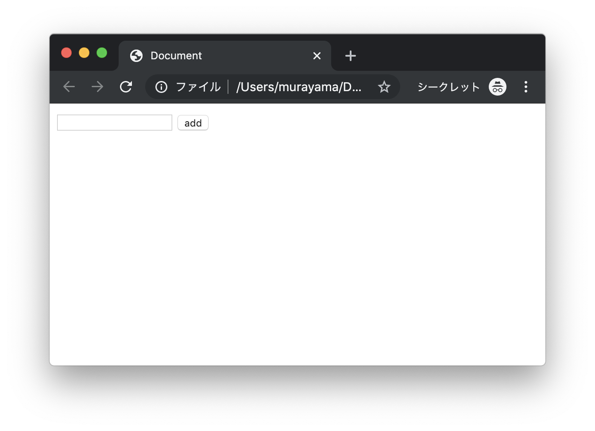
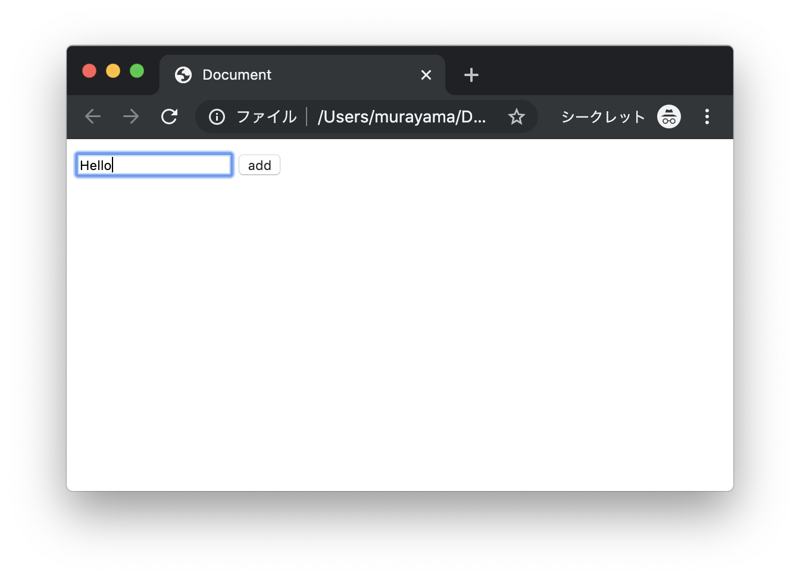
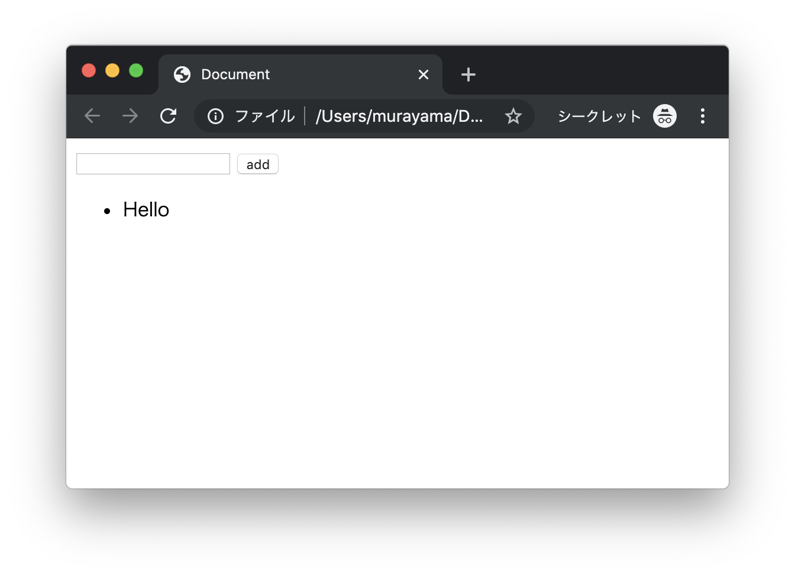
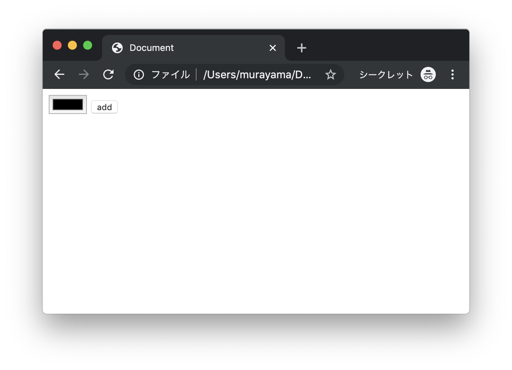
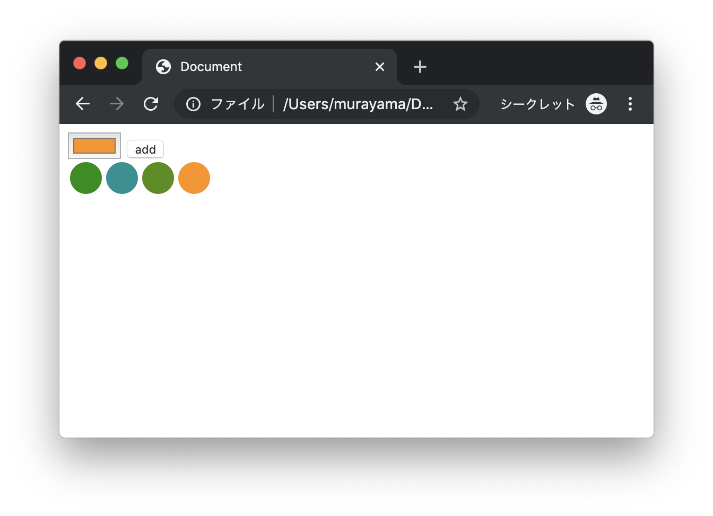

# エクササイズ - JavaScript - DOM - Part2

## dom_ex5.html

次の実行結果となるようにプログラムを作成してください。

### 実行結果

#### 初期表示時



#### テキスト入力




#### ボタンクリック




### HTML

```html
<!DOCTYPE html>
<html lang="ja">
<head>
  <meta charset="UTF-8">
  <title>Document</title>
  <script type="text/javascript">
    function addComment() {
      // TODO
    }
  </script>
</head>
<body>
  <input type="text" id="comment">
  <button onclick="addComment()">add</button>
  <ul id="comments"></ul>
</body>
</html>
```

> 上記のコードをコピーしてファイルを作成します。

---


## dom_ex6.html

次の実行結果となるようにプログラムを作成してください。

### 実行結果

#### 初期表示時



#### カラー選択後、ボタンクリック


#### 繰り返し入力可能


### HTML

```html
<!DOCTYPE html>
<html lang="ja">
<head>
  <meta charset="UTF-8">
  <title>Document</title>
  <script type="text/javascript">
    function addPanel() {
      // TODO
    }
  </script>
</head>
<body>
  <input type="color" id="my-color">
  <button onclick="addPanel()">add</button>
  <div id="main" style="display: flex;"></div>
</body>
</html>
```

> 上記のコードをコピーしてファイルを作成します。

---


## dom_ex7.html

dom_ex6.htmlを修正して、次の実行結果となるようにプログラムを作成してください。

### 実行結果



---

## dom_ex8.html

dom_ex7.htmlを修正して、次の実行結果となるようにプログラムを作成してください。

### 実行結果


---

