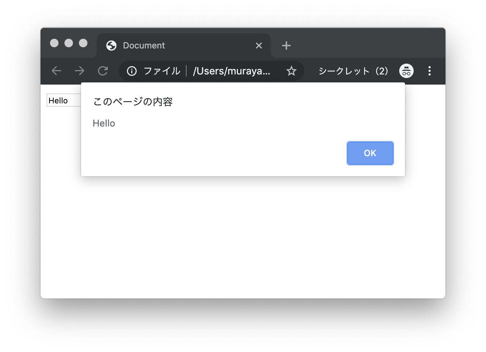
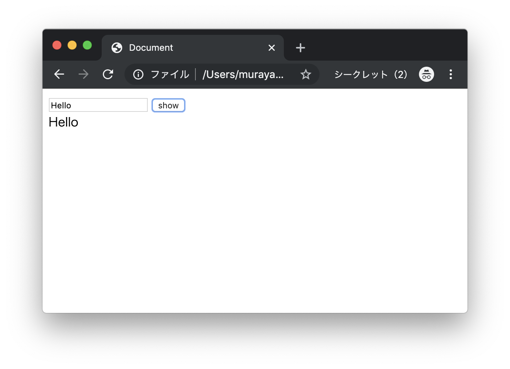
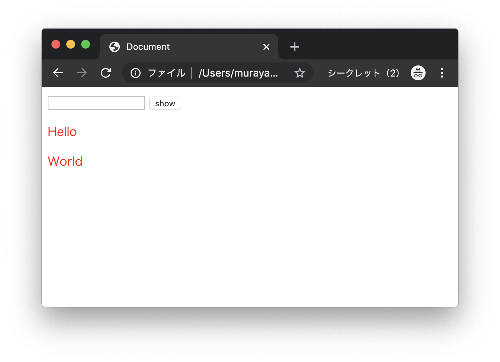
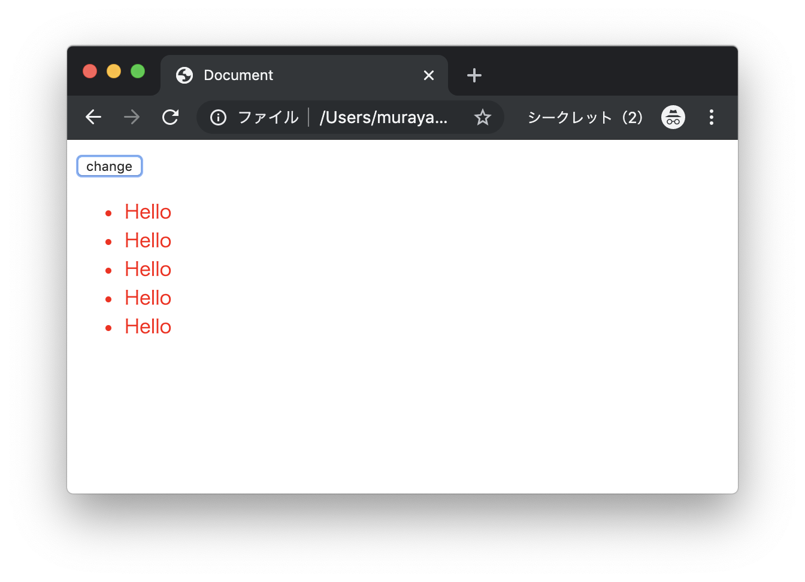
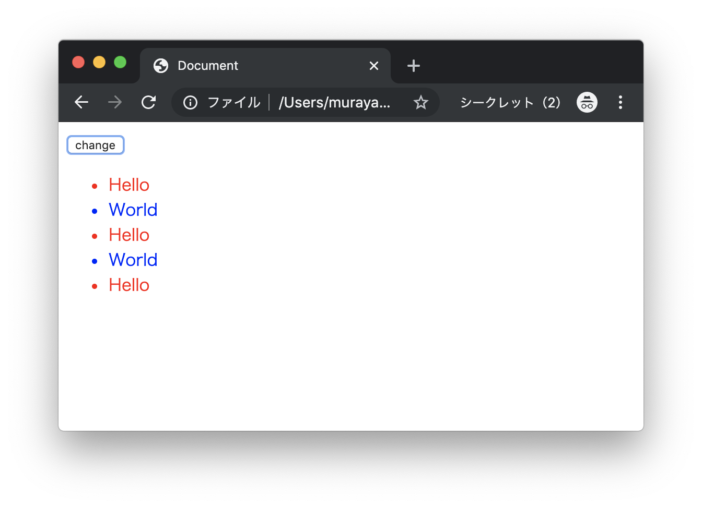

# エクササイズ - JavaScript - DOM - Part2

## jq_ex1.html

次の実行結果となるようにプログラムを作成してください。

### 実行結果

#### ボタンクリック



> ボタンクリック時にテキストボックスの内容をアラート表示します。

### HTML

```html
<!DOCTYPE html>
<html lang="ja">
<head>
  <meta charset="UTF-8">
  <title>Document</title>
  <script src="https://ajax.googleapis.com/ajax/libs/jquery/3.4.1/jquery.min.js"></script>
  <script>
  $(function() {

    $("#my-btn").click(function(e){

      // TODO

    });

  });
  </script>
</head>
<body>
  <input type="text" id="my-text">
  <button id="my-btn">show</button>
  <div id="main"></div>
</body>
</html>
```

> 上記のコードをコピーしてファイルを作成します。

---

## jq_ex2.html

次の実行結果となるようにプログラムを作成してください。

### 実行結果

#### ボタンクリック



> ボタンクリック時にテキストボックスの内容を画面に表示します。

### HTML

```html
<!DOCTYPE html>
<html lang="ja">
<head>
  <meta charset="UTF-8">
  <title>Document</title>
  <script src="https://ajax.googleapis.com/ajax/libs/jquery/3.4.1/jquery.min.js"></script>
  <script>

  // TODO

  </script>
</head>
<body>
  <input type="text" id="my-text">
  <button id="my-btn">show</button>
  <div id="main"></div>
</body>
</html>
```

> 上記のコードをコピーしてファイルを作成します。

---


## jq_ex3.html

次の実行結果となるようにプログラムを作成してください。

### 実行結果

#### ボタンクリック



> ボタンクリック時にテキストボックスの内容を画面に赤色で表示します。ただし、ボタンを押すごとに、テキストボックスの内容を追記できるものとします。

### HTML

```html
<!DOCTYPE html>
<html lang="ja">
<head>
  <meta charset="UTF-8">
  <title>Document</title>
  <script src="https://ajax.googleapis.com/ajax/libs/jquery/3.4.1/jquery.min.js"></script>
  <script>

  // TODO

  </script>
</head>
<body>
  <input type="text" id="my-text">
  <button id="my-btn">show</button>
  <div id="main"></div>
</body>
</html>

```

> 上記のコードをコピーしてファイルを作成します。

---

## jq_ex4.html

次の実行結果となるようにプログラムを作成してください。

### 実行結果

#### ボタンクリック



> ボタンクリック時にリストの内容を"Hello"（文字色は赤色）に変更します。

### HTML

```html
<!DOCTYPE html>
<html lang="ja">
<head>
  <meta charset="UTF-8">
  <title>Document</title>
  <script src="https://ajax.googleapis.com/ajax/libs/jquery/3.4.1/jquery.min.js"></script>
  <script>
  // TODO
  </script>
</head>
<body>
  <button id="my-btn">change</button>
  <ul>
    <li class="odd">one</li>
    <li class="even">two</li>
    <li class="odd">three</li>
    <li class="even">four</li>
    <li class="odd">five</li>
  </ul>
</body>
</html>

```

> 上記のコードをコピーしてファイルを作成します。

---

## jq_ex5.html

次の実行結果となるようにプログラムを作成してください。

### 実行結果

#### ボタンクリック



> ボタンクリック時にリストの奇数行を"Hello"（文字色は赤色）、偶数行を"World"（文字色は青色）に変更します。

### HTML

```html
<!DOCTYPE html>
<html lang="ja">
<head>
  <meta charset="UTF-8">
  <title>Document</title>
  <script src="https://ajax.googleapis.com/ajax/libs/jquery/3.4.1/jquery.min.js"></script>
  <script>

  // TODO

  </script>
</head>
<body>
  <button id="my-btn">change</button>
  <ul>
    <li class="odd">one</li>
    <li class="even">two</li>
    <li class="odd">three</li>
    <li class="even">four</li>
    <li class="odd">five</li>
  </ul>
</body>
</html>

```

> 上記のコードをコピーしてファイルを作成します。

---

