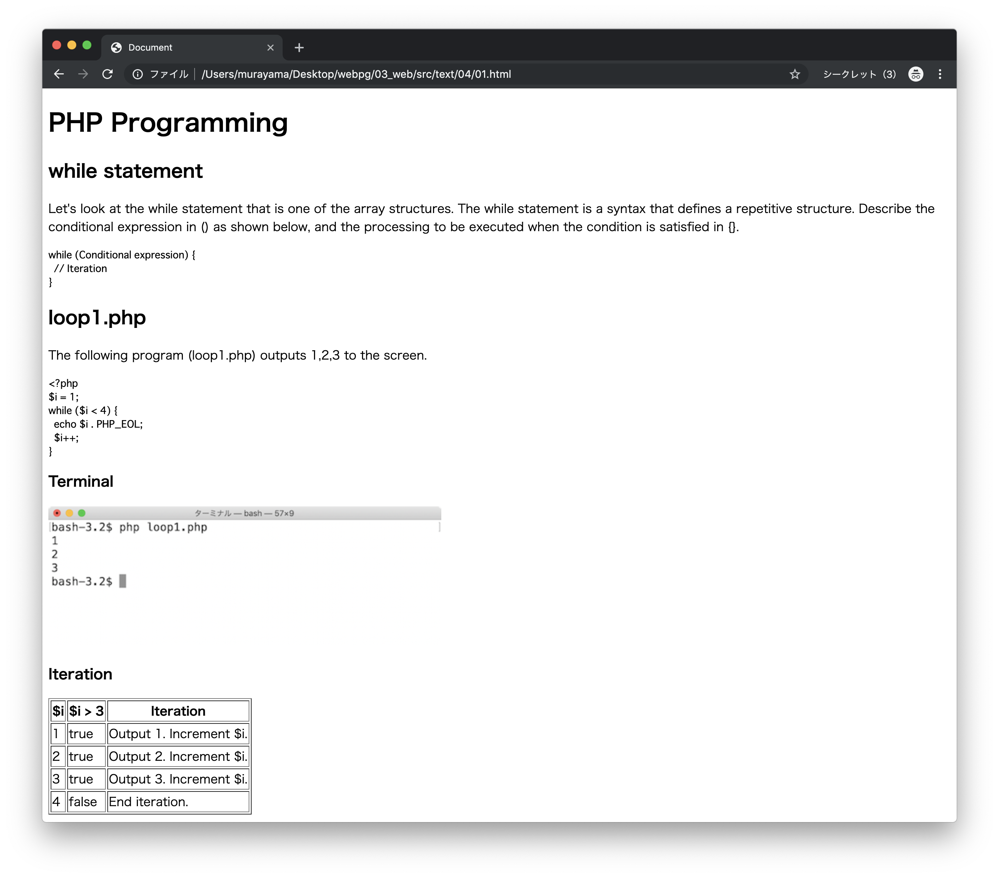
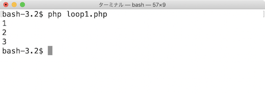

# 演習 HTML/CSS

## 演習1 HTMLファイルの作成

次の結果を出力するHTMLファイル（`01.html`）を作成してください。




### 素材

#### テキスト素材

```
PHP Programming

while statement

Let's look at the while statement that is one of the array structures. The while statement is a syntax that defines a repetitive structure. Describe the conditional expression in () as shown below, and the processing to be executed when the condition is satisfied in {}.

while (Conditional expression) {
  // Iteration
}

loop1.php

The following program (loop1.php) outputs 1,2,3 to the screen.

<?php
$i = 1;
while ($i < 4) {
  echo $i . PHP_EOL;
  $i++;
}

Terminal


Iteration

$i	$i > 3	Iteration
1	true	Output 1. Increment $i.
2	true	Output 2. Increment $i.
3	true	Output 3. Increment $i.
4	false	End iteration.
```

#### イメージ素材



> 右クリックのメニューから`loop1.png`という名前でファイルを保存します。

#### ヒント

+ 見出しには`h1`, `h2`, `h3`タグを使います。
+ 段落は`p`タグを使います。
+ プログラムの表示には`pre`タグを使います。
+ 画像は`img`タグを使います。
+ 表は`table`タグを使います。

