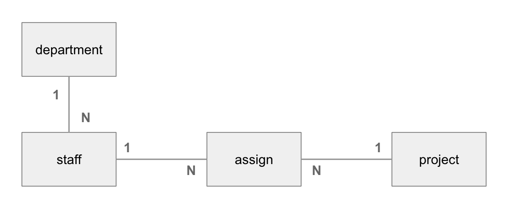

# SQL - Part3

## 目的

以下のテーブルを作成します。

+ `department`
+ `staff`
+ `project`
+ `assign`




### departmentテーブル

```
+----+-------------+
| id | name        |
+----+-------------+
|  1 | Development |
|  2 | Sales       |
|  3 | Accounting  |
|  4 | Legal       |
+----+-------------+
```


### staffテーブル

```
+----+-----------+------------+------------+------+------------+---------------+
| id | name      | job        | hire_date  | sal  | manager_id | department_id |
+----+-----------+------------+------------+------+------------+---------------+
|  1 | Sarah     | Engineer   | 2016-04-01 | 1500 |       NULL |             1 |
|  2 | Amanda    | Engineer   | 2016-04-01 | 1200 |          1 |             1 |
|  3 | Michael   | Sales      | 2016-10-01 | 1000 |       NULL |             2 |
|  4 | Robert    | Engineer   | 2017-04-01 |  800 |          1 |             1 |
|  5 | James     | Engineer   | 2017-04-01 | 1500 |          1 |             1 |
|  6 | Nicole    | Accountant | 2017-04-01 | 1000 |       NULL |             3 |
|  7 | John      | Marketer   | 2018-04-01 |  800 |          2 |          NULL |
|  8 | Elizabeth | Sales      | 2018-04-01 |  800 |          3 |             2 |
|  9 | Joseph    | Sales      | 2018-10-01 |  700 |          3 |             2 |
+----+-----------+------------+------------+------+------------+---------------+
```

### projectテーブル

```
+----+-----------+------------+------------+
| id | name      | start_date | end_date   |
+----+-----------+------------+------------+
|  1 | Project A | 2019-01-01 | 2019-06-30 |
|  2 | Project B | 2019-01-01 | 2019-09-30 |
|  3 | Project C | 2019-03-01 | 2019-04-30 |
+----+-----------+------------+------------+
```


### assignテーブル

```
+----+------------+----------+
| id | project_id | staff_id |
+----+------------+----------+
|  1 |          1 |        1 |
|  2 |          1 |        5 |
|  3 |          1 |        8 |
|  4 |          2 |        2 |
|  5 |          2 |        3 |
|  6 |          2 |        4 |
|  7 |          3 |        5 |
|  8 |          3 |        7 |
|  9 |          3 |        9 |
+----+------------+----------+
```

---

## データベースの接続

```sql
use my_company;
```

---

## テーブルの作成


```sql
drop table if exists department;
create table department(
  id int primary key,
  name varchar(100)
);
```

```sql
drop table if exists staff;
create table staff(
  id int primary key,
  name varchar(100),
  job varchar(100),
  hire_date date,
  sal int not null,
  manager_id int,
  department_id int
);
```

```sql
drop table if exists project;
create table project(
  id int primary key,
  name varchar(100),
  start_date date,
  end_date date
);
```

```sql
drop table if exists assign;
create table assign(
  id int primary key,
  project_id int,
  staff_id int
);
```


### テーブル一覧の確認

```sql
show tables;
```

```
+----------------------+
| Tables_in_my_company |
+----------------------+
| assign               |
| department           |
| project              |
| staff                |
+----------------------+
```

---

## レコードの作成

```sql
insert into department(id, name) values(1, 'Development');
insert into department(id, name) values(2, 'Sales');
insert into department(id, name) values(3, 'Accounting');
insert into department(id, name) values(4, 'Legal');
```

```sql
insert into staff(id, name, job, hire_date, sal, manager_id, department_id) values(1, 'Sarah', 'Engineer', '2016-04-01', 1500, null, 1);
insert into staff(id, name, job, hire_date, sal, manager_id, department_id) values(2, 'Amanda', 'Engineer', '2016-04-01', 1200, 1, 1);
insert into staff(id, name, job, hire_date, sal, manager_id, department_id) values(3, 'Michael', 'Sales', '2016-10-01', 1000, null, 2);
insert into staff(id, name, job, hire_date, sal, manager_id, department_id) values(4, 'Robert', 'Engineer', '2017-04-01', 800, 1, 1);
insert into staff(id, name, job, hire_date, sal, manager_id, department_id) values(5, 'James', 'Engineer', '2017-04-01', 1500, 1, 1);
insert into staff(id, name, job, hire_date, sal, manager_id, department_id) values(6, 'Nicole', 'Accountant', '2017-04-01', 1000, null, 3);
insert into staff(id, name, job, hire_date, sal, manager_id, department_id) values(7, 'John', 'Marketer', '2018-04-01', 800, 2, null);
insert into staff(id, name, job, hire_date, sal, manager_id, department_id) values(8, 'Elizabeth', 'Sales', '2018-04-01', 800, 3, 2);
insert into staff(id, name, job, hire_date, sal, manager_id, department_id) values(9, 'Joseph', 'Sales', '2018-10-01', 700, 3, 2);
```

```sql
insert into project(id, name, start_date, end_date) values(1, 'Project A', '2019-01-01', '2019-06-30');
insert into project(id, name, start_date, end_date) values(2, 'Project B', '2019-01-01', '2019-09-30');
insert into project(id, name, start_date, end_date) values(3, 'Project C', '2019-03-01', '2019-04-30');
```

```sql
insert into assign(id, project_id, staff_id) values(1, 1, 1);
insert into assign(id, project_id, staff_id) values(2, 1, 5);
insert into assign(id, project_id, staff_id) values(3, 1, 8);
insert into assign(id, project_id, staff_id) values(4, 2, 2);
insert into assign(id, project_id, staff_id) values(5, 2, 3);
insert into assign(id, project_id, staff_id) values(6, 2, 4);
insert into assign(id, project_id, staff_id) values(7, 3, 5);
insert into assign(id, project_id, staff_id) values(8, 3, 7);
insert into assign(id, project_id, staff_id) values(9, 3, 9);
```

---

## レコードの表示

+ Project Aに所属しているstaffの一覧を表示する

```sql
select
  p.name, s.name
from project p
  inner join assign a on p.id = a.project_id
  inner join staff s on a.staff_id = s.id
where p.id = 1;
```

```
+-----------+-----------+
| name      | name      |
+-----------+-----------+
| Project A | Sarah     |
| Project A | James     |
| Project A | Elizabeth |
+-----------+-----------+
```

+ Jamesが所属しているprojectの一覧を表示する

```sql
select s.name, p.name
from staff s
  inner join assign a on s.id = a.staff_id
  inner join project p on a.project_id = p.id
where
  s.id = 5;
```

```
+-------+-----------+
| name  | name      |
+-------+-----------+
| James | Project A |
| James | Project C |
+-------+-----------+
```

+ 2019-06-01時点でJamesが所属しているprojectの一覧を表示する

```sql
select s.name, p.name
from staff s
  inner join assign a on s.id = a.staff_id
  inner join project p on a.project_id = p.id
where
  s.id = 5
  and p.start_date <= '2019-06-01'
  and '2019-06-01' <= p.end_date;
```

```
+-------+-----------+
| name  | name      |
+-------+-----------+
| James | Project A |
+-------+-----------+
```

---

## エクササイズ

[エクササイズ](ex/03_sql_ex.md)
