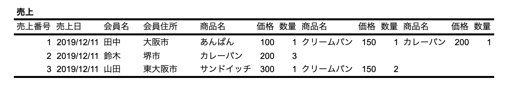
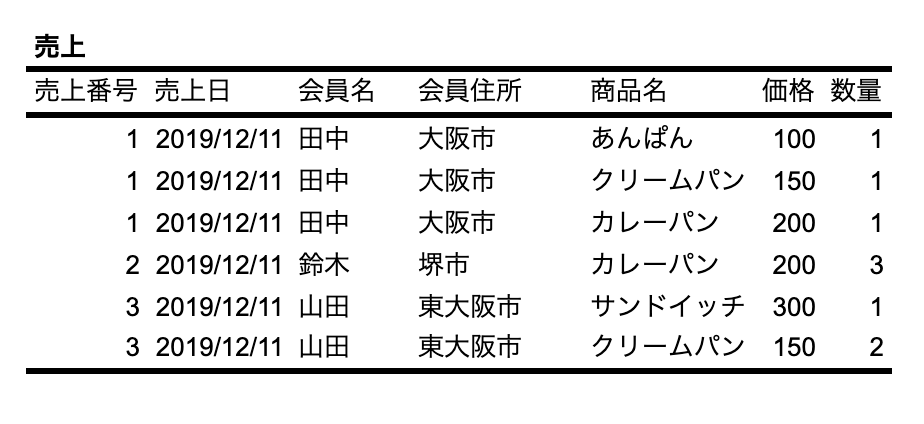
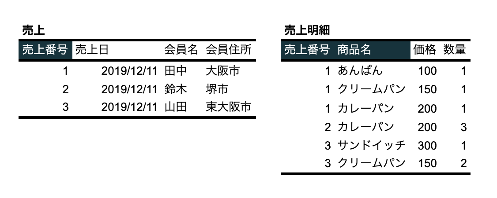
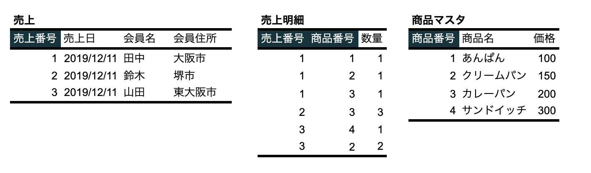

# テーブルの正規化

ここでは「会員制のパン屋さん」を想定した売上データの正規化に取り組みます。

### 非正規系

+ データが正規化されていない状態

### 第1正規化

+ 繰返し項目を排除する

↓

> 売上テーブルの主キーは売上番号、売上明細番号の主キーは売上番号と商品名です。複数の項目で主キーを構成するものを複合主キーと呼びます。

---
### 第2正規化

+ 複合主キーの一部で決まる項目を分離する

↓

> ここでは第2正規化を進める際に、新たに商品番号を追加しています。

---

### 第3正規化

+ 主キー以外の項目に従属する項目を分離する

↓

> ここでは第3正規化を進める際に、新たに会員番号を追加しています。

---

## エクササイズ

[エクササイズ](ex/04_normalization_ex.md)
