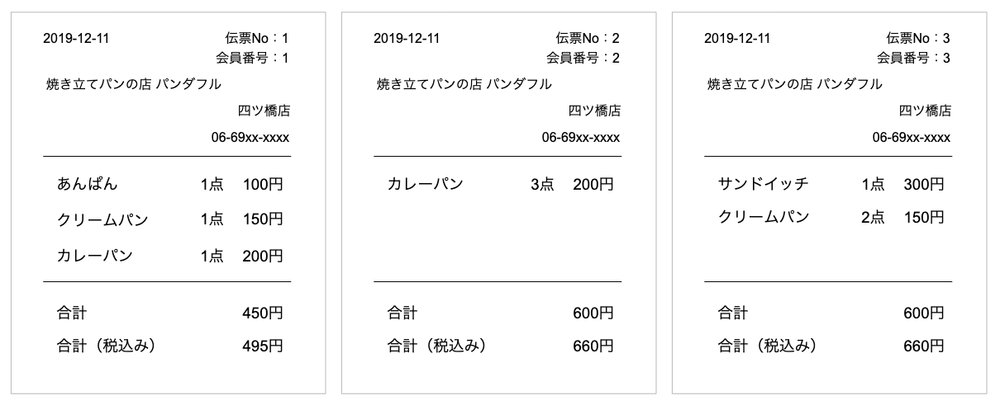

# エクササイズ - トランザクション管理

### 売上データの管理

以下の5つのテーブルを作成します。

+ shop
+ customer
+ item
+ sale
+ sale_detail

### テーブル定義

> 以下のSQLをコピーして実行します。

```sql
create database shop;
use shop;

drop table if exists shop;
create table shop (
    no int primary key,
    name varchar(100),
    tel varchar(20)
);

drop table if exists customer;
create table customer(
    no int primary key,
    name varchar(100),
    address varchar(100)
);

drop table if exists item;
create table item(
    no int primary key,
    name varchar(100),
    price int
);

drop table if exists sale;
create table sale(
    no int primary key,
    datetime datetime,
    shop_no int,
    customer_no int
);

drop table if exists sale_detail;
create table sale_detail(
    sale_no int,
    item_no int,
    num int,
    primary key(sale_no, item_no)
);
```

### マスタデータの登録

> 以下のSQLをコピーして実行します。

```sql
insert into shop values(1, '四ツ橋店', '06-69xx-xxxx');

insert into customer values(1, '田中', '大阪市');
insert into customer values(2, '鈴木', '堺市');
insert into customer values(3, '山田', '東大阪市');

insert into item values(1, 'あんぱん', 100);
insert into item values(2, 'クリームパン', 150);
insert into item values(3, 'カレーパン', 200);
insert into item values(4, 'サンドイッチ', 300);
```

### 課題 - トランザクションデータの登録

以下の3枚のレシートを登録してください。ただし、レシートごとにトランザクションを開始して、明示的にコミットするものとします。


