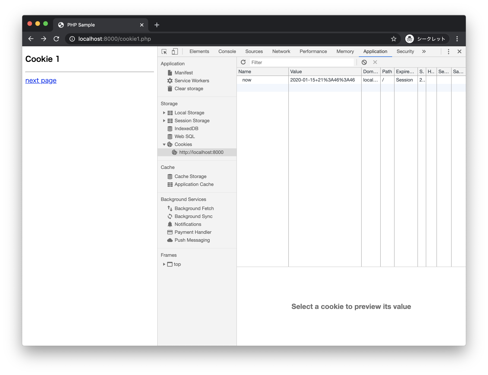
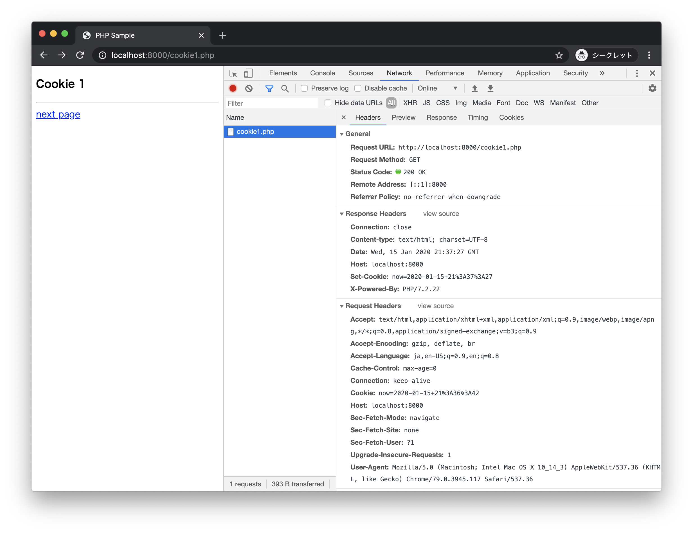
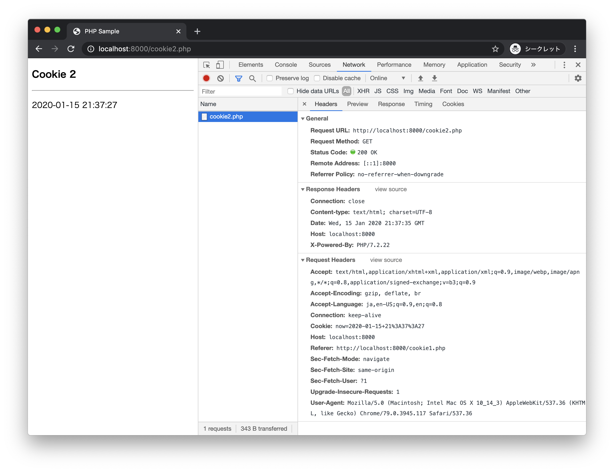

# Cookie

+ Cookieを使えばサーバからクライアント上に少量のデータを残すことができる
+ レスポンスに`Set-Cookie`ヘッダを指定することでブラウザ上のCookieにデータを保存できる
+ Cookieに保存されたデータは同一ドメインへのリクエストに`Cookie`ヘッダとして送信される

> Cookieに保存できるデータには制限があります。ブラウザの実装によって保存できるデータの数やサイズ（数KB）に上限があります。またCookieに保存したデータは有効期限を過ぎると削除されます。Chromeの場合はデベロッパーツールのApplicationタブにおいて、Cookieに保存したデータを確認できます。




### cookie1.php

+ PHPプログラムからブラウザ上のCookieにデータを保存するには`setcookie`関数を使う
+ `setcookie`関数の引数には「キーと値」を指定する

```php
<?php
$now = date("Y-m-d H:i:s");
setcookie("now", $now);
?>
<!DOCTYPE html>
<html lang="ja">
<head>
  <meta charset="UTF-8">
  <title>PHP Sample</title>
</head>
<body>
  <h3>Cookie 1</h3>
  <hr>
  <a href="cookie2.php">next page</a>
</body>
</html>
```

> HTTPレスポンスにSet-Cookieヘッダが追加されます。



#### 実行 - ビルトインWebサーバの起動

```
> php -S localhost:8000
```

> ブラウザから http://localhost:8000/cookie1.php にアクセスします。

---

### cookie2.php

+ Cookieに保存されているデータは同一ドメインへのリクエスト送信時に、リクエストヘッダ（`Cookie`ヘッダ）に含まれるようになる
+ PHPプログラムから送信された`Cookie`ヘッダにアクセスするには`$_COOKIE`変数を使う

```php
<?php
$now = $_COOKIE["now"];
?>
<!DOCTYPE html>
<html lang="ja">
<head>
  <meta charset="UTF-8">
  <title>PHP Sample</title>
</head>
<body>
  <h3>Cookie 2</h3>
  <hr>
  <p><?php echo $now; ?></p>
</body>
</html>
```

> HTTPリクエストに`Cookie`ヘッダが追加されます。




### cookie3.html

+ Cookieに保存しているデータはJavaScriptからアクセスすることもできる

```html
<!DOCTYPE html>
<html lang="ja">
<head>
  <meta charset="UTF-8">
  <title>PHP Sample</title>
  <script>
    function showCookie() {
      var myDiv = document.querySelector("#my-div");
      myDiv.innerHTML = document.cookie;
    }
  </script>
</head>
<body onload="showCookie()">
  <h3>Cookie 3</h3>
  <hr>
  <div id="my-div"></div>
</body>
</html>
```

> Cookieに保存しているデータはクライアント上で編集できることを覚えておきましょう。

---

### 演習

+ [エクササイズ - Cookie](ex/04_ex.md)
