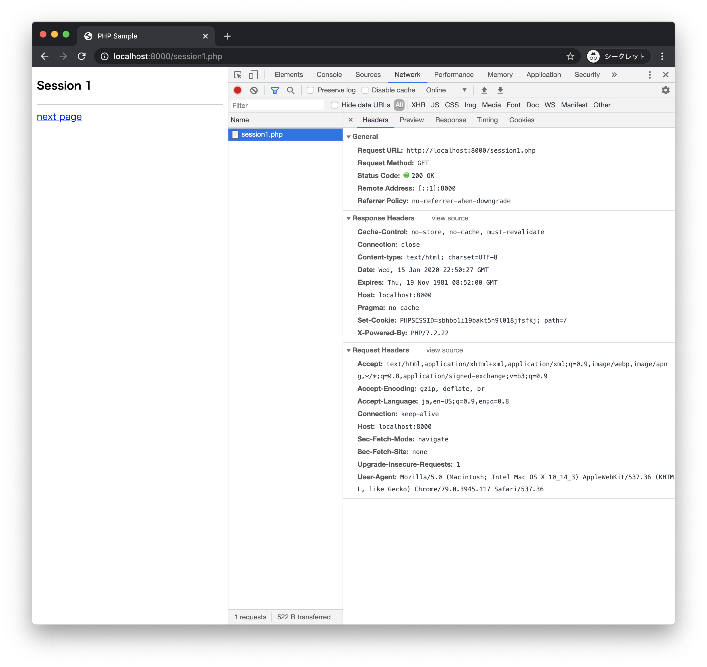
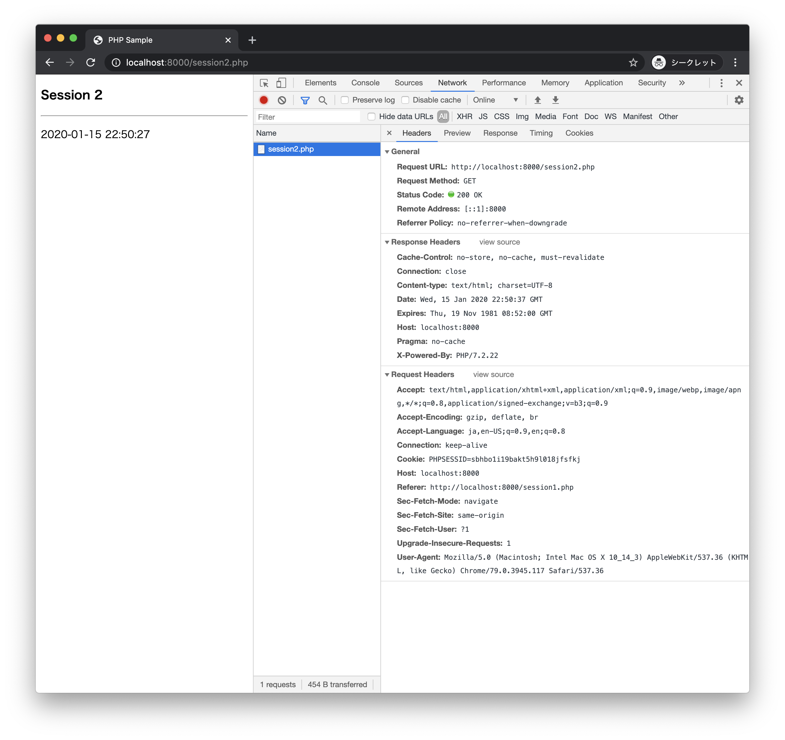

# セッション

+ セッションはクライアントとの一連のやりとりを管理する仕組み
+ ログインしたユーザの情報管理や、ECサイトのショッピングカートの実現などに使用する
+ `$_SESSION`に保存したデータはクライアントごとに別の領域で管理される

> セッションを実現するための内部でCookieを使うことが一般的です。Chromeのデベロッパーツールを使ってどのようなデータがやりとりされるのかを確認しましょう。

### session1.php

+ `$_SESSION`変数にアクセスするには事前に`session_start`関数を呼び出す必要がある
+ `session_start`関数を呼び出すことで、HTTPレスポンスにSet-Cookieヘッダが追加される（Cookieのキーはデフォルトで`PHPSESSID`となる）
+ `$_SESSION`変数に保存したデータそのものはサーバサイドに保存される

```php
<?php
session_start();
$now = date("Y-m-d H:i:s");
$_SESSION["now"] = $now;
?>
<!DOCTYPE html>
<html lang="ja">
<head>
  <meta charset="UTF-8">
  <title>PHP Sample</title>
</head>
<body>
  <h3>Session 1</h3>
  <hr>
  <a href="session2.php">next page</a>
</body>
</html>
```

> HTTPレスポンスにSet-Cookieヘッダが追加されます。



#### 実行 - ビルトインWebサーバの起動

```
> php -S localhost:8000
```

> ブラウザから http://localhost:8000/session1.php にアクセスします。

---

### session2.php

+ PHPプログラムから送信された`Cookie`ヘッダにアクセスするには`$_COOKIE`変数を使う

```php
<?php
session_start();
$now = $_SESSION["now"];
?>
<!DOCTYPE html>
<html lang="ja">
<head>
  <meta charset="UTF-8">
  <title>PHP Sample</title>
</head>
<body>
  <h3>Session 2</h3>
  <hr>
  <p><?php echo $now; ?></p>
</body>
</html>
```

> HTTPリクエストに`Cookie`ヘッダが追加されます。



> 一般的にセッションに保存したデータはサーバサイドに保存されます。そのためセッションの利用は必要最小限にすべきです。セッションのデータは有効期限（デフォルトは180分）を過ぎると破棄されるようになっています。セッションを破棄するには`session_destroy`関数を使います。セッションを管理する関数についてはPHPマニュアルの[セッション関数](https://www.php.net/manual/ja/ref.session.php)を参照します。

---

### 演習

+ [エクササイズ - セッション](ex/05_ex.md)
