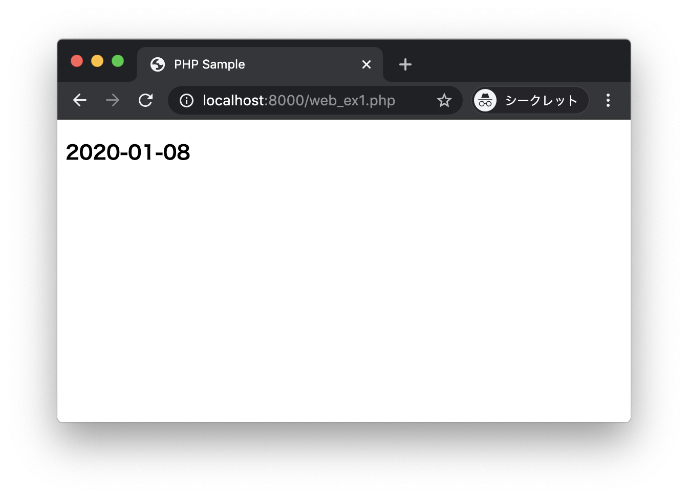
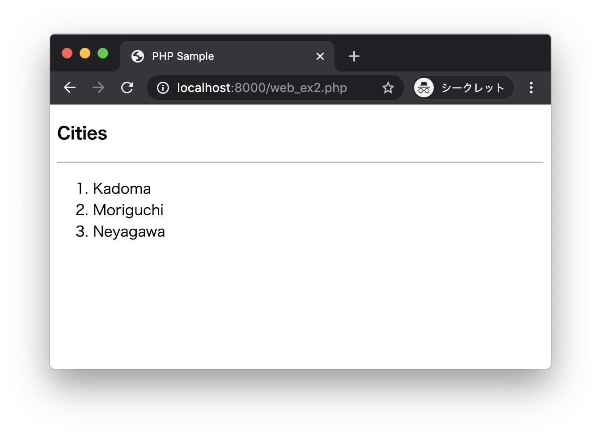
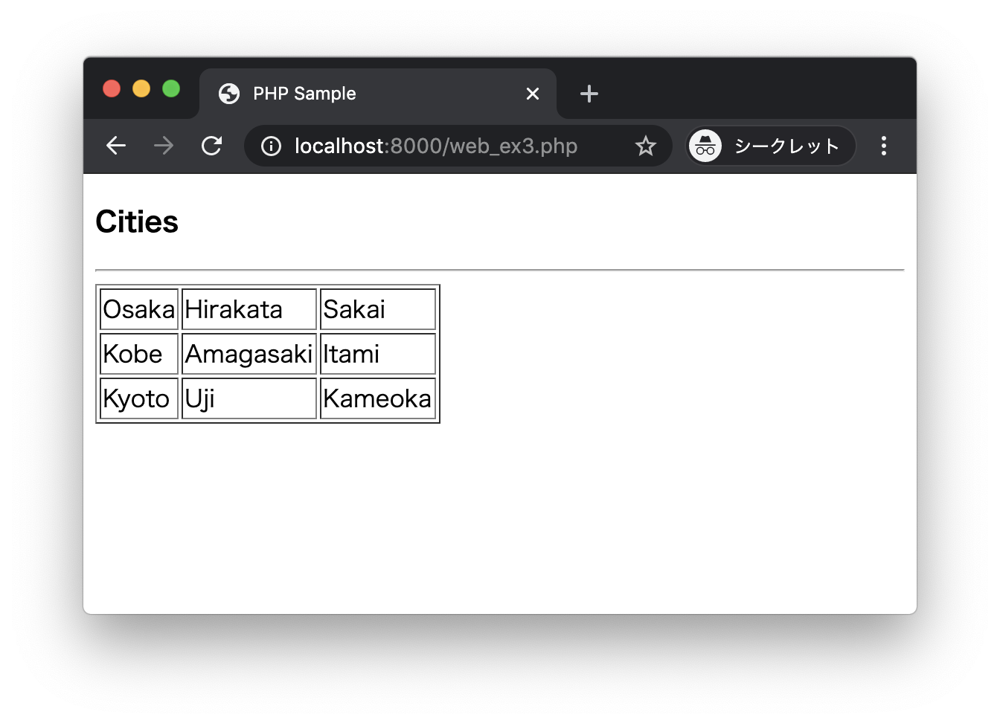

# エクササイズ - PHP - Webアプリケーション開発

## web_ex1.php

次の実行結果となるようにPHPプログラムを作成してください。

### 実行結果



> ブラウザから http://localhost:8000/web_ex1.php にアクセスします。
現在日付が表示されるようにプログラミングします。

### ヒント

現在の日時を取得するには`date`関数を使います。

```php
<?php
$date = date("Y-m-d");
```

---


## web_ex2.php

カレントフォルダに次のファイル`cities.txt`を準備します。

```
Kadoma
Moriguchi
Neyagawa
```

> 上記のデータをコピーしてファイルを作成してください。

次の実行結果となるようにPHPプログラムを作成してください。

### 実行結果



> `cities.txt`の内容を表示します。

### ヒント

ファイルの読み込みには[file](https://www.php.net/manual/ja/function.file.php)関数を使うことができます。

```php
<?php
$file = "cities.txt";
$cities = file($file, FILE_IGNORE_NEW_LINES);
var_dump($cities);
```

---

## web_ex3.php

カレントフォルダに次のファイル`cities.csv`を準備します。

```
Osaka,Hirakata,Sakai
Kobe,Amagasaki,Itami
Kyoto,Uji,Kameoka
```

> 上記のデータをコピーしてファイルを作成してください。

次の実行結果となるようにPHPプログラムを作成してください。

### 実行結果



> `cities.csv`の内容を表示します。

### ヒント

以下の関数を組み合わせて実装してみましょう。

+ fopen
+ fgets
+ fclose
+ explode

---

