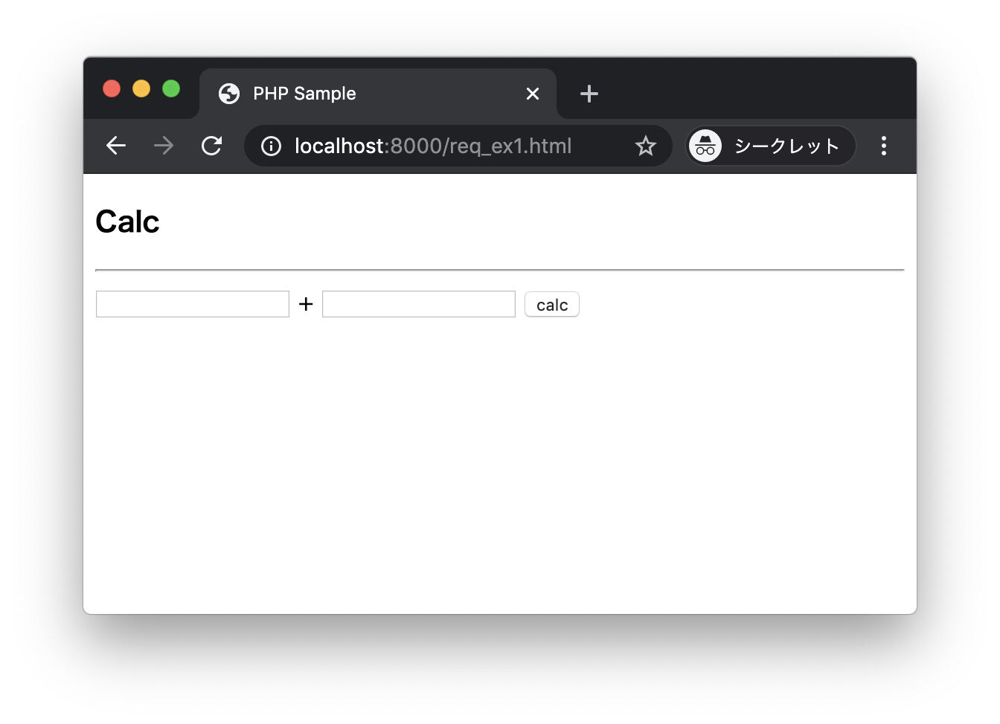
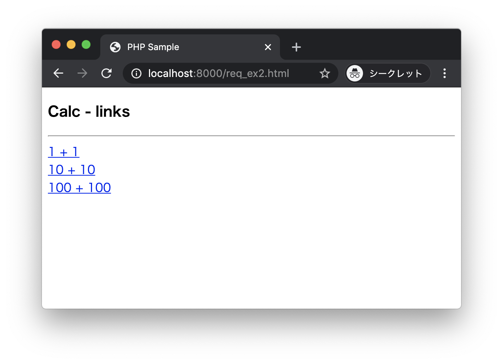
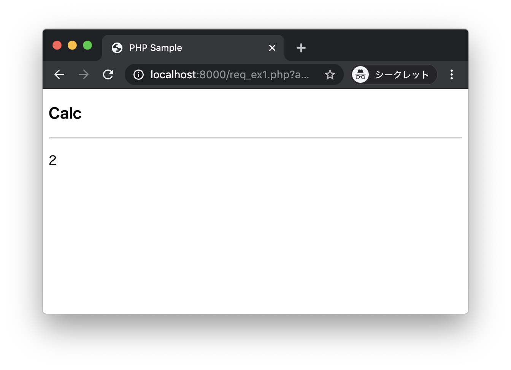
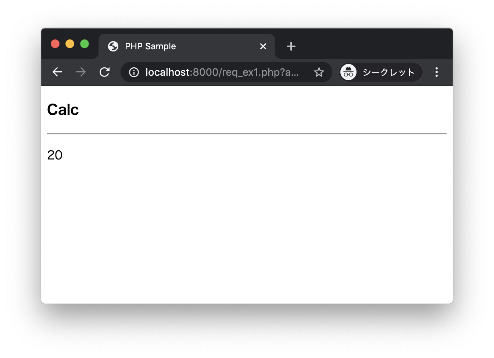
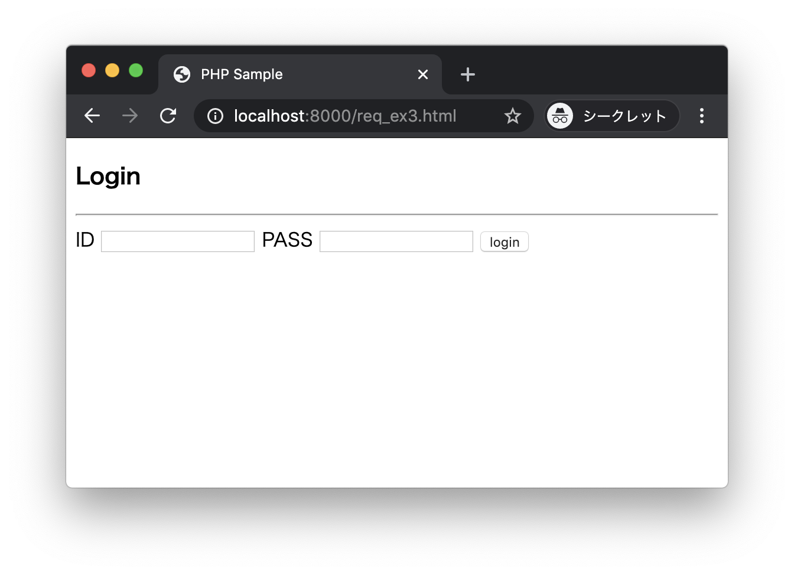
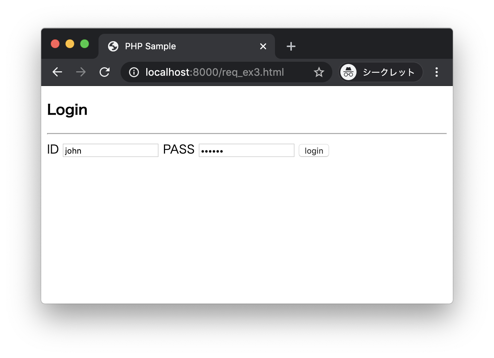
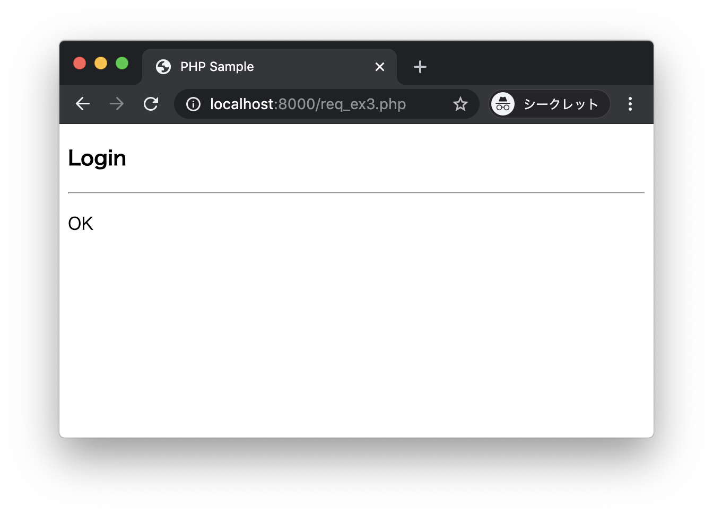
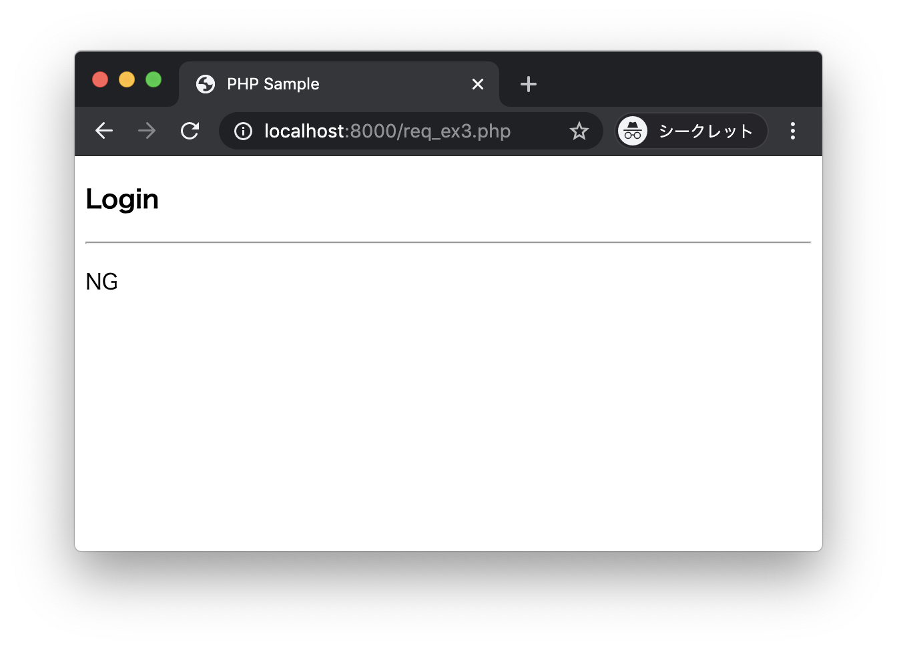
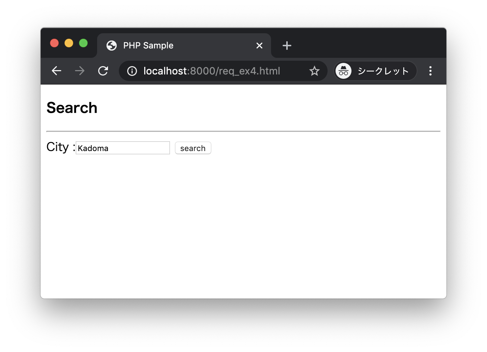

# エクササイズ - HTTPリクエスト

## req_ex1.html req_ex1.php

次の実行結果となるようにPHPプログラムを作成してください。

### 実行結果

ブラウザから http://localhost:8000/req_ex1.html にアクセスします。



2つのテキストボックスに数値を入力して`calc`ボタンをクリックします。


`req_ex1.php`において2つの数値の加算結果を出力します。


---


## req_ex2.html

次の実行結果となるようにPHPプログラムを作成してください。

### 実行結果

ブラウザから http://localhost:8000/req_ex2.html にアクセスします。



表示された3つのリンクのいずれかをクリックすると、`req_ex1.php`によって加算結果が表示されます。

+ `1 + 1`をクリックした場合



+ `10 + 10`をクリックした場合



+ `100 + 100`をクリックした場合


---


## req_ex3.html req_ex3.php

次の実行結果となるようにPHPプログラムを作成してください。

### 実行結果

ブラウザから http://localhost:8000/req_ex3.html にアクセスします。



2つのテキストボックスにIDとパスワードを入力して`login`ボタンをクリックします。




+ 入力されたIDが`john`でパスワードが`secret`の場合、`req_ex3.php`において以下のように表示します。



+ 上記以外の場合、`req_ex3.php`において以下のように表示します。



---

## req_ex4.html req_ex4.php

次の実行結果となるようにPHPプログラムを作成してください。

### 実行結果

ブラウザから http://localhost:8000/req_ex4.html にアクセスします。


テキストボックスに`City`を入力して`search`ボタンをクリックします。




+ `req_ex3.php`において、リクエストパラメータと以下の`cities.txt`ファイルを照合して、データが存在する場合は、次のように表示します。

```
Kadoma
Moriguchi
Neyagawa
```


+ データが存在しない場合は、次のように表示します。


---


