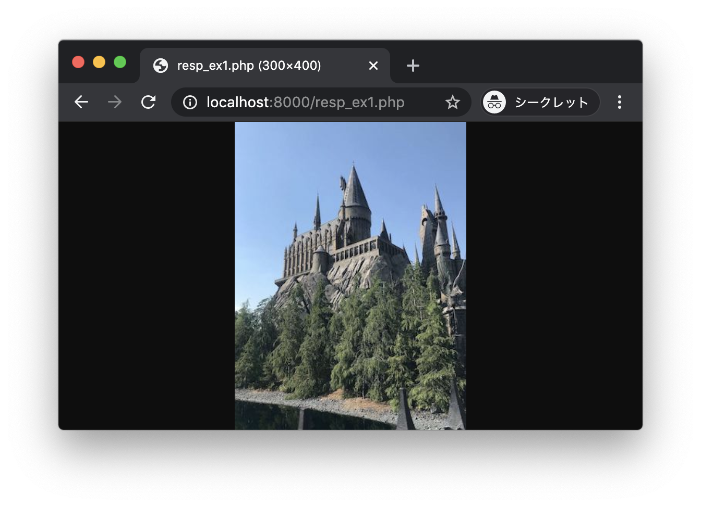
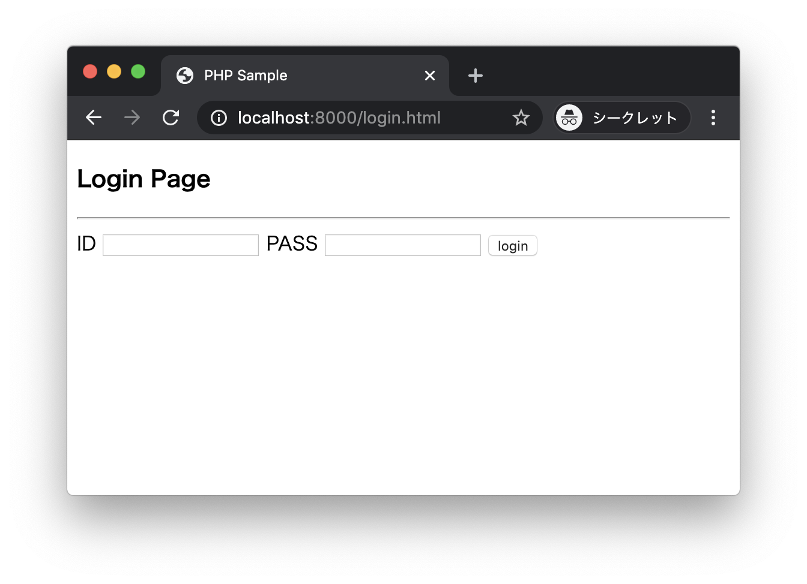
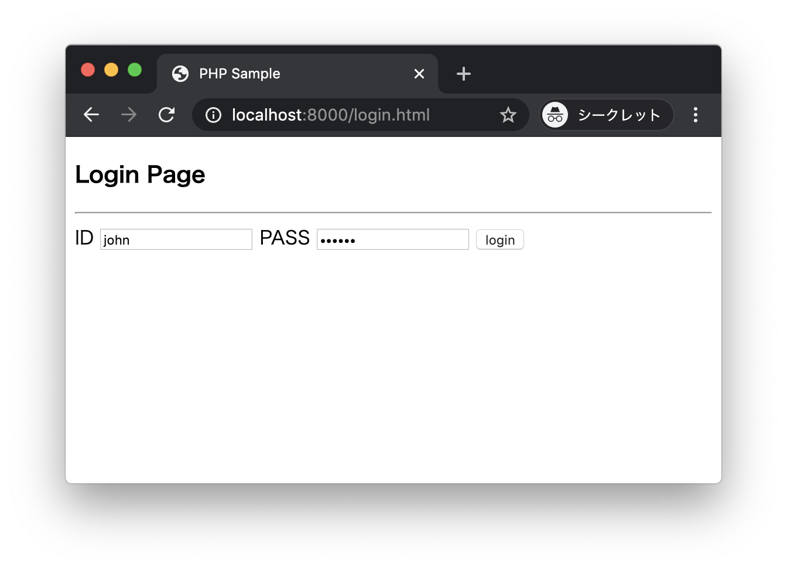
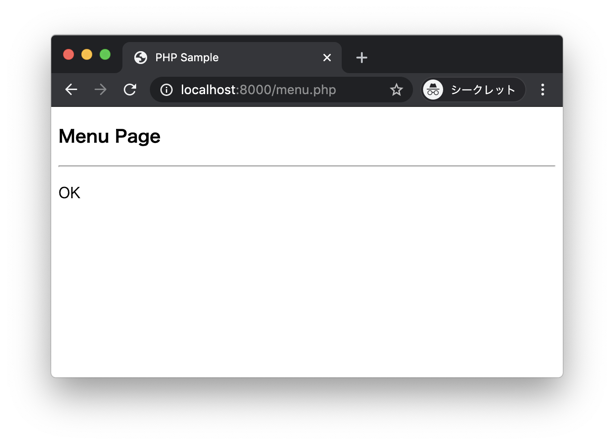
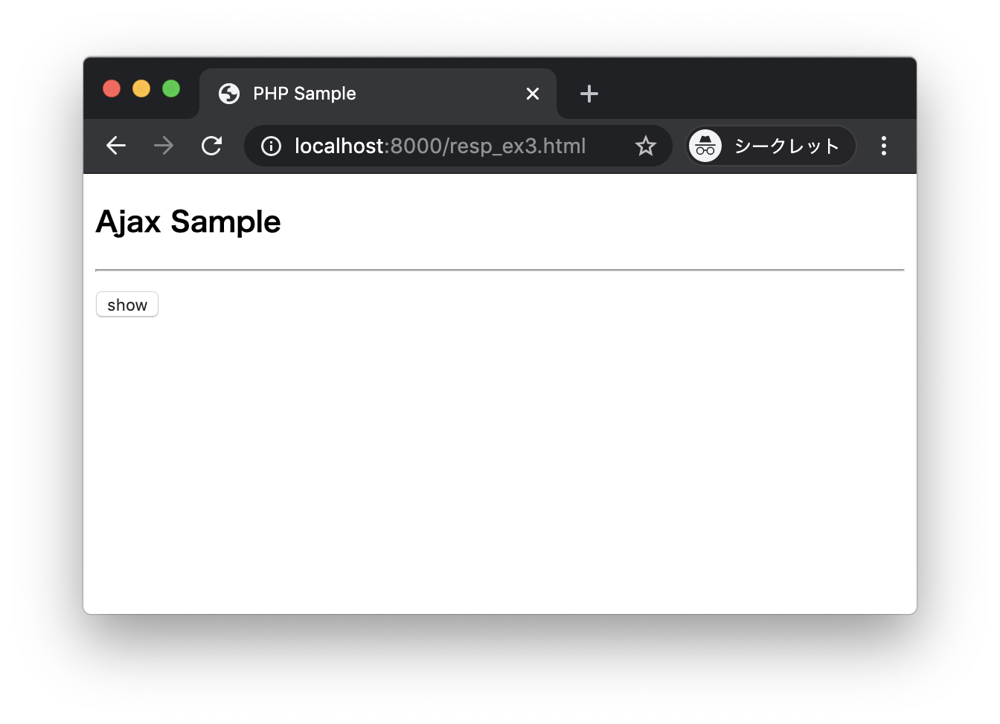
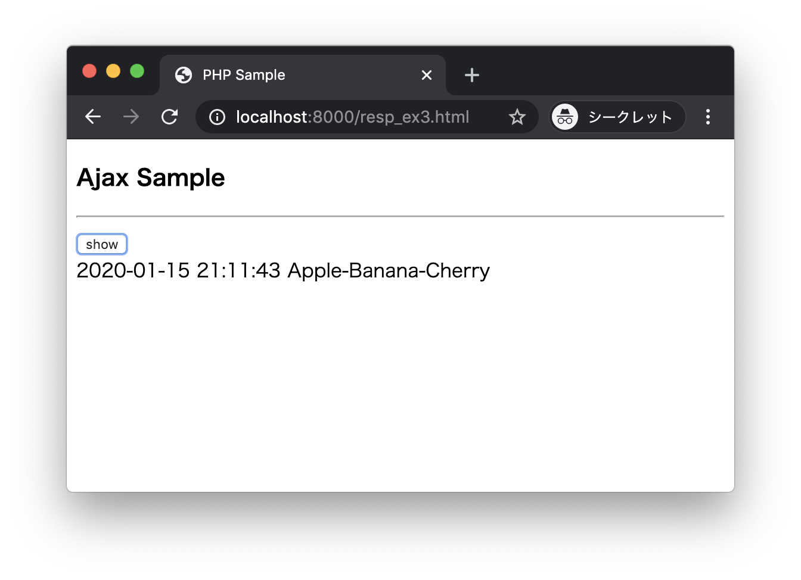

# エクササイズ - HTTPレスポンス

## resp_ex1.php

次の実行結果となるようにPHPプログラムを作成してください。

### 実行結果

ブラウザから http://localhost:8000/resp_ex1.php にアクセスします。



> PHPプログラムで以下のsample.jpgを読み込んで出力します。

### sample.jpg


> 右クリックメニューからファイルをダウンロードしてください。


### ヒント

```php
<?php
$file = "sample.jpg";
// TODO
echo file_get_contents($file);
```

> 画像を表示するためのContent-Typeを設定してください。

---


## login.html login.php menu.php

次の実行結果となるようにPHPプログラムを作成してください。

### 実行結果

ブラウザから http://localhost:8000/login.html にアクセスします。



2つのテキストボックスにIDとパスワードを入力して`login`ボタンをクリックします。



+ 入力されたIDが`john`でパスワードが`secret`の場合、`login.php`において`menu.php`にリダイレクトします。



+ 上記以外の場合、`login.php`において`login.html`にリダイレクトします。


---


## resp_ex3.html resp_ex3.php

次の実行結果となるようにPHPプログラムを作成してください。

### 実行結果

ブラウザから http://localhost:8000/resp_ex3.html にアクセスします。



`show`ボタンをクリックします。



> ボタンをクリックすると非同期なHTTPリクエストが送信されます。このようなプログラムはAJAXなどと呼ばれます。

### サンプルコード

以下の2つのファイルを作成します。プログラムは完成しているので、そのまま書き写してみましょう。それからプログラムの仕組みを確認してみましょう。

#### resp_ex3.html

```html
<!DOCTYPE html>
<html lang="ja">
<head>
  <meta charset="UTF-8">
  <title>PHP Sample</title>
  <script src="https://ajax.googleapis.com/ajax/libs/jquery/3.4.1/jquery.min.js"></script>
  <script>
    $(function() {
      $("#my-btn").click(function() {
        $.ajax({
          url: "http://localhost:8000/resp_ex3.php",
          dataType: 'json',
          success: function(resp) {
            var date = resp.date;
            var fruits = resp.fruits.join("-");
            $("#my-div").html(date + " " + fruits);
          }
        });
      });
    })
  </script>
</head>
<body>
  <h3>Ajax Sample</h3>
  <hr>
  <button type="button" id="my-btn">show</button>
  <div id="my-div"></div>
</body>
</html>
```

#### resp_ex3.php

```php
<?php
$value = [];
$value["date"] = date("Y-m-d H:i:s");
$value["fruits"] = ["Apple", "Banana", "Cherry"];

header("Content-type: application/json");
$json_contents = json_encode($value);
echo $json_contents;
```

---
