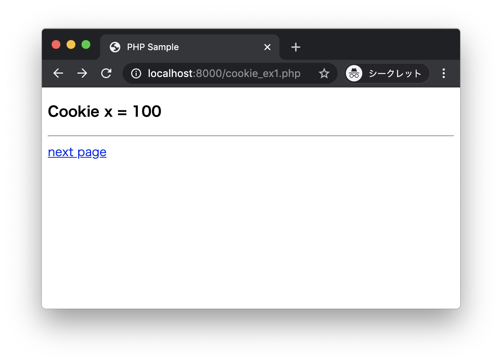
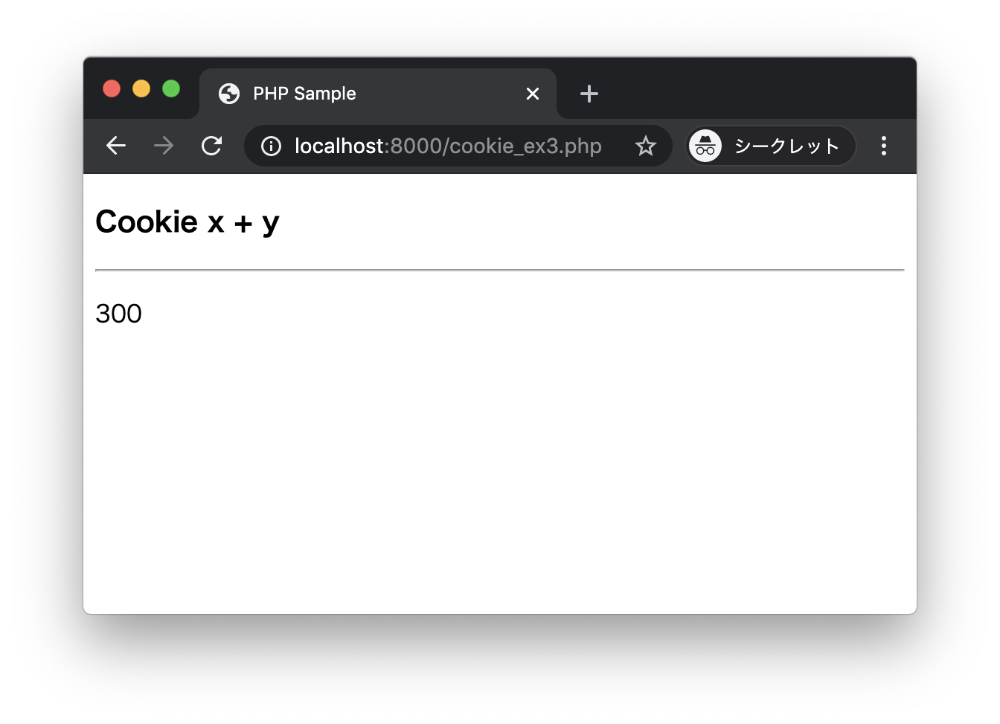

# エクササイズ - Cookie

## cookie_ex1.php cookie_ex2.php cookie_ex3.php

次の実行結果となるようにPHPプログラムを作成してください。

### 実行結果

ブラウザから http://localhost:8000/cookie_ex1.php にアクセスします。



`cookie_ex1.php`ではCookieに以下のデータを保存します。

|キー|値|
|:--|:--|
|x|100|

next pageリンクをクリックして、`cookie_ex2.php`にアクセスします。


`cookie_ex2.php`ではCookieに新たに以下のデータを保存します。

|キー|値|
|:--|:--|
|y|200|

この時点でCookieにはx、y2つのキーが保存されています。

|キー|値|
|:--|:--|
|x|100|
|y|200|

next pageリンクをクリックして、`cookie_ex3.php`にアクセスします。



`cookie_ex3.php`では送信されたCookieの`x`と`y`2つのキーを参照して、合計値を求めて出力します。


### cookie_ex1.php

```php
<?php
// Cookieにx = 100を保存する
?>
<!DOCTYPE html>
<html lang="ja">
<head>
  <meta charset="UTF-8">
  <title>PHP Sample</title>
</head>
<body>
  <h3>Cookie x = 100</h3>
  <hr>
  <a href="cookie_ex2.php">next page</a>
</body>
</html>
```

> cookie_ex2.phpも同様に作成します。

### cookie_ex3.php

```php
<?php
// Cookieからx, y を取得して合計を求める
?>
<!DOCTYPE html>
<html lang="ja">
<head>
  <meta charset="UTF-8">
  <title>PHP Sample</title>
</head>
<body>
  <h3>Cookie x + y</h3>
  <hr>
  <p><?php echo $total; ?></p>
</body>
</html>
```

---
