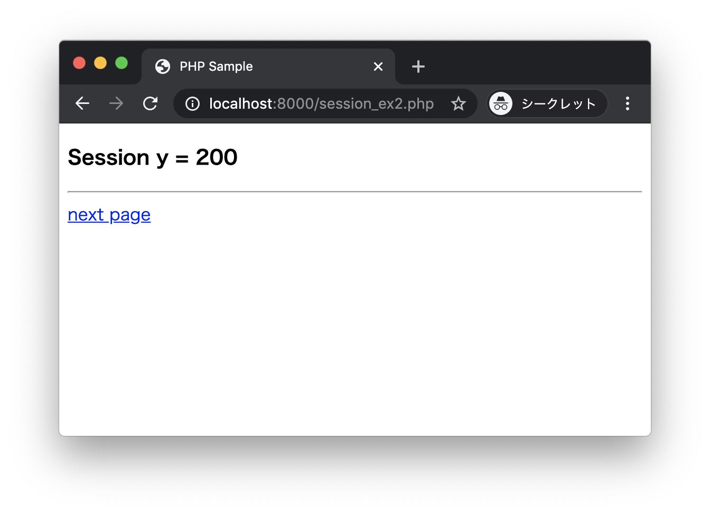

# エクササイズ - セッション

## session_ex1.php session_ex2.php session_ex3.php

次の実行結果となるようにPHPプログラムを作成してください。

### 実行結果

ブラウザから http://localhost:8000/session_ex1.php にアクセスします。


`session_ex1.php`ではCookieに以下のデータを保存します。

|キー|値|
|:--|:--|
|PHPSESSID|ランダムな文字列|

このときサーバサイドにセッションデータを以下のように保存しています。

|キー|値|
|:--|:--|
|x|100|

next pageリンクをクリックして、`session_ex2.php`にアクセスします。



`session_ex2.php`ではCookieに以下のデータを保存します。

|キー|値|
|:--|:--|
|PHPSESSID|ランダムな文字列|

このときサーバサイドにセッションデータを以下のように保存しています。

|キー|値|
|:--|:--|
|y|200|

この時点でサーバサイドのセッションデータにはx、y2つのキーが保存されています。

|キー|値|
|:--|:--|
|x|100|
|y|200|

next pageリンクをクリックして、`session_ex3.php`にアクセスします。


`session_ex3.php`ではセッション上の`x`と`y`2つのキーを参照して、合計値を求めて出力します。


### session_ex1.php

```php
<?php
// セッションにx = 100を保存する
?>
<!DOCTYPE html>
<html lang="ja">
<head>
  <meta charset="UTF-8">
  <title>PHP Sample</title>
</head>
<body>
  <h3>Session x = 100</h3>
  <hr>
  <a href="session_ex2.php">next page</a>
</body>
</html>
```

> session_ex2.phpも同様に作成します。

### session_ex3.php

```php
<?php
// セッションからx, y を取得して合計を求める
?>
<!DOCTYPE html>
<html lang="ja">
<head>
  <meta charset="UTF-8">
  <title>PHP Sample</title>
</head>
<body>
  <h3>Session x + y</h3>
  <hr>
  <p><?php echo $total; ?></p>
</body>
</html>
```

---
