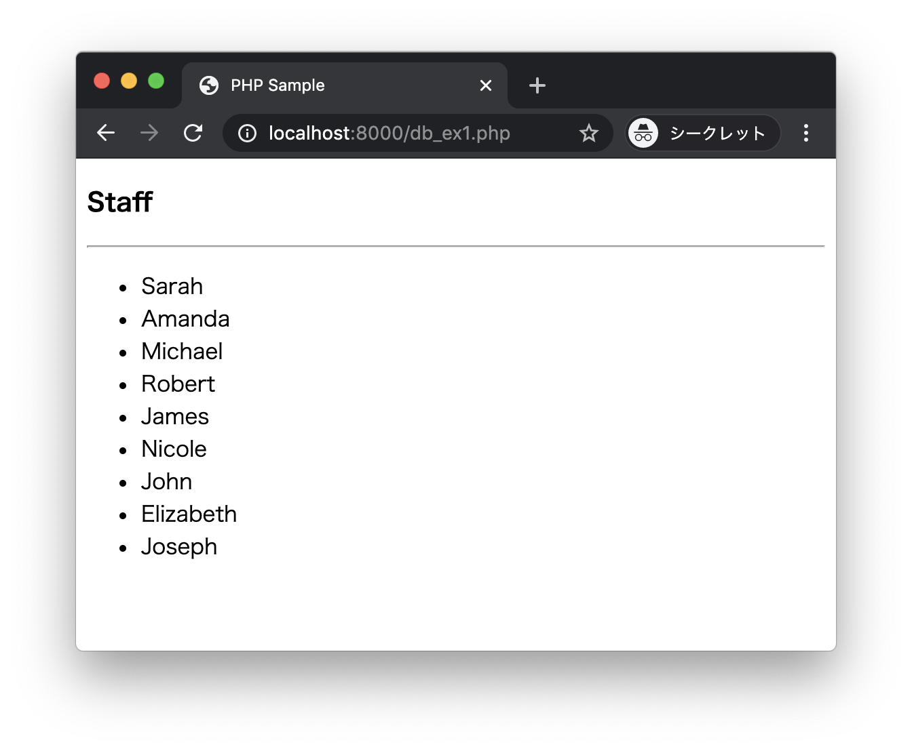
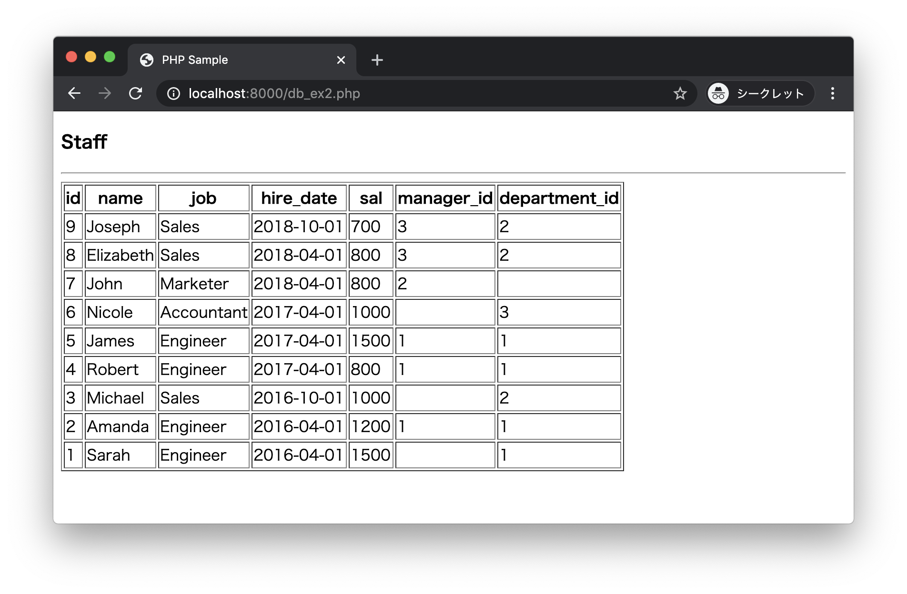

# エクササイズ - データベース

以下のSQLを実行してテストデータを準備してください。

## 01_ex.sql

```sql
drop table if exists staff;
create table staff(
  id int primary key,
  name varchar(100),
  job varchar(100),
  hire_date date,
  sal int not null,
  manager_id int,
  department_id int
);

insert into staff(id, name, job, hire_date, sal, manager_id, department_id) values(1, 'Sarah', 'Engineer', '2016-04-01', 1500, null, 1);
insert into staff(id, name, job, hire_date, sal, manager_id, department_id) values(2, 'Amanda', 'Engineer', '2016-04-01', 1200, 1, 1);
insert into staff(id, name, job, hire_date, sal, manager_id, department_id) values(3, 'Michael', 'Sales', '2016-10-01', 1000, null, 2);
insert into staff(id, name, job, hire_date, sal, manager_id, department_id) values(4, 'Robert', 'Engineer', '2017-04-01', 800, 1, 1);
insert into staff(id, name, job, hire_date, sal, manager_id, department_id) values(5, 'James', 'Engineer', '2017-04-01', 1500, 1, 1);
insert into staff(id, name, job, hire_date, sal, manager_id, department_id) values(6, 'Nicole', 'Accountant', '2017-04-01', 1000, null, 3);
insert into staff(id, name, job, hire_date, sal, manager_id, department_id) values(7, 'John', 'Marketer', '2018-04-01', 800, 2, null);
insert into staff(id, name, job, hire_date, sal, manager_id, department_id) values(8, 'Elizabeth', 'Sales', '2018-04-01', 800, 3, 2);
insert into staff(id, name, job, hire_date, sal, manager_id, department_id) values(9, 'Joseph', 'Sales', '2018-10-01', 700, 3, 2);
```

---

## db_ex1.php

次の実行結果となるようにPHPプログラムを作成してください。

### 実行結果

ブラウザから http://localhost:8000/db_ex1.php にアクセスします。




### db_ex1.php

```php
<?php
// TODO staffテーブルからデータを取得します。
?>
<!DOCTYPE html>
<html lang="ja">
<head>
  <meta charset="UTF-8">
  <title>PHP Sample</title>
</head>
<body>
  <h3>Staff</h3>
  <hr>
  <ul>
  <?php foreach ($rows as $row) { ?>
    <li><?php echo $row["name"]; ?></li>
  </tr>
  <?php } ?>
  </ul>
</body>
</html>
```

> `staff`テーブルのデータを出力します。

---

## db_ex2.php

次の実行結果となるようにPHPプログラムを作成してください。

### 実行結果

ブラウザから http://localhost:8000/db_ex2.php にアクセスします。




> `staff`テーブルのデータを出力します。データの並び順は`id`列の降順とします。

---

## db_ex3.html db_ex3.php

次の実行結果となるようにPHPプログラムを作成してください。

### 実行結果

ブラウザから http://localhost:8000/db_ex3.html にアクセスします。


データを入力し`save`ボタンをクリックします。


`staff`テーブルに新規レコードが登録され、ブラウザにはdb_ex2.phpへリダイレクトした結果が表示されます。


> 上記の場合、`id`が`10`のレコードが追加されているのがわかります。

---

## db_ex4.html db_ex4.php

次の実行結果となるようにPHPプログラムを作成してください。

### 実行結果

ブラウザから http://localhost:8000/db_ex4.html にアクセスします。


データを入力し`search`ボタンをクリックします。


staffテーブルをあいまい検索した結果（前後方一致）が表示されます。


> 上記の場合、`name`に`b`を含むデータが表示されているのがわかります。

---
