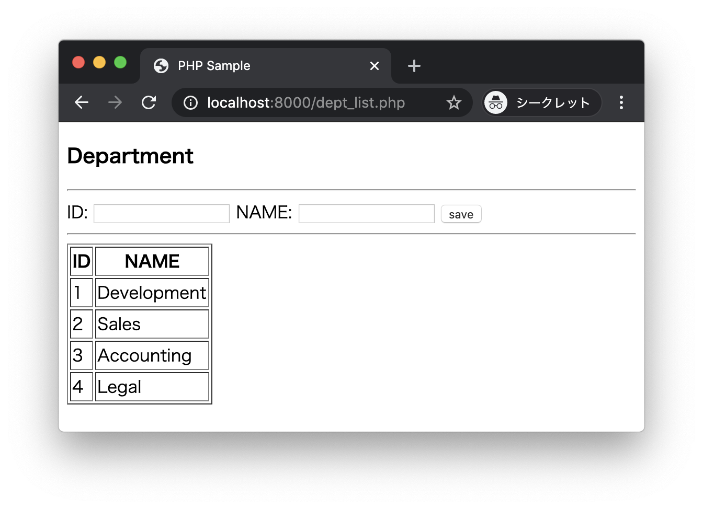

# エクササイズ - セキュリティ

以下のSQLを実行してテストデータを準備してください。

## 01_ex.sql

```sql
drop table if exists message;
create table message(
  id int primary key auto_increment,
  text varchar(255),
  created_at datetime default current_timestamp
);

insert into message(text) values('Hello World!');
```

---

## bbs.php bbs_post.php

次の実行結果となるようにPHPプログラムを作成してください。

### 実行結果

ブラウザから http://localhost:8000/bbs.php にアクセスします。


メッセージを入力してpostボタンをクリックします。


入力されたメッセージを一覧の先頭に表示します。




### bbs.php

```php
<?php
$pdo = new PDO("mysql:host=localhost;dbname=my_company", "root", "admin");
$sql = "select * from message order by id desc";
$st = $pdo->query($sql);
$messages = $st->fetchAll();
?>
<!DOCTYPE html>
<html lang="ja">
<head>
  <meta charset="UTF-8">
  <title>PHP Sample</title>
</head>
<body>
  <h3>MY BBS</h3>
  <hr>
  <form action="bbs_post.php" method="post">
    MESSAGE: <input type="text" name="text">
    <button type="submit">post</button>
  </form>
  <ul>
    <!-- TODO -->
  </ul>
</body>
</html>
```

> SQLを実装して、取得したデータを`ul`タグと`li`タグで表示します。

### bbs_post.php

```php
<?php
// TODO
```

> bbs_post.phpでは、入力されたメッセージをデータベース（`message`テーブル）に保存し、bbs.phpにリダイレクトします。

---
